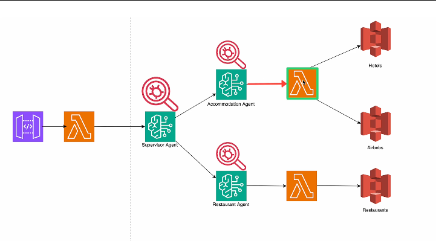

# [Agentic AI](../../courses.md)

- [Agentic AI](#agentic-ai)
  - [ZTM: AI Agents with AWS](#ztm-ai-agents-with-aws)
    - [Intro](#intro)

## ZTM: AI Agents with AWS

### Intro

- Create a root AWS account -- create or delete users
- Create a IAM User account -- use this for all sign-ins
- Least Privilege Access -- Administrative Access ❌
- Unique sign-in URL

  

- 
- Amazon Bedrock US(Oregon) has highest api rate for On-demand InvokeModel requests per minute for Claude 3.5 Sonnet V2
- Bedrock configurations > Model access > Modify model access > Submit request to get access to model
- Bedrock > Builder Tools > Agents > Create agent
  - Agent Name
  - Select model
  - Instructions for Agent
  - Action Groups
    - Action group function 1
      - Parameters
    - Action Group 