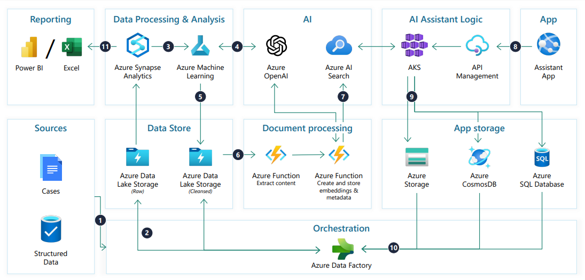

# [Agentic AI](../../courses.md)

- [Agentic AI](#agentic-ai)
  - [ZTM: AI Agents with AWS](#ztm-ai-agents-with-aws)
    - [Intro](#intro)
  - [Microsoft: AI Skills Fest - Public Sector](#microsoft-ai-skills-fest---public-sector)
    - [Create and draft with Microsoft 365 Copilot](#create-and-draft-with-microsoft-365-copilot)
    - [Edit and transform content with Mcirosoft 365 Copilot](#edit-and-transform-content-with-mcirosoft-365-copilot)
    - [Ask questions and analyze content with Microsoft 365 Copilot](#ask-questions-and-analyze-content-with-microsoft-365-copilot)

## ZTM: AI Agents with AWS

### Intro

- Create a root AWS account -- create or delete users
- Create a IAM User account -- use this for all sign-ins
- Least Privilege Access -- Administrative Access ❌
- Unique sign-in URL

  

- 
- Amazon Bedrock US(Oregon) has highest api rate for On-demand InvokeModel requests per minute for Claude 3.5 Sonnet V2
- Bedrock configurations > Model access > Modify model access > Submit request to get access to model
- Bedrock > Builder Tools > Agents > Create agent
  - Agent Name
  - Select model
  - Instructions for Agent
  - Action Groups
    - Action group function 1
      - Parameters
    - Action Group 

## Microsoft: AI Skills Fest - Public Sector 

- Enhance Public Sector services with generative AI

- [Simplifying Case Management](https://onedrive.live.com/?authkey=%21ACBBJCRM%5FMQ3%2DsU&id=91F4E618548FC604%2119593&cid=91F4E618548FC604&parId=root&parQt=sharedby&o=OneUp)
  
- [Simplifying rulemaking](https://1drv.ms/b/s!AgTGj1QY5vSRgZkIb4f5jzjpfU2DaA?e=4ECXDf)
  
- [Empower constituents](https://1drv.ms/b/s!AgTGj1QY5vSRgZkE0POddKSlhRP9Sw?e=CkelB4)
  
- [Migrate Legacy Applications](https://1drv.ms/b/s!AgTGj1QY5vSRgZkFwJQiZ_3gZnWpOA?e=yD2SQ6)
  
- [Fraud Investigations](https://1drv.ms/b/s!AgTGj1QY5vSRgZkBiYQ9cFnrFS3F8A?e=W8k0I9)
  
- [Multimodal image analysis](https://1drv.ms/b/s!AgTGj1QY5vSRgZkGZXwybR0a5pn0kQ?e=2QDrPn)
  
- [Create knowledge hubs](https://1drv.ms/b/s!AgTGj1QY5vSRgZkCGceXiSof3s4s3A?e=9Q7ouL)
  
- [Improve security posture](https://1drv.ms/b/s!AgTGj1QY5vSRgZkDYYH_ziCFsokBNg?e=PKw3TS)
  

  

- Embrace responsible AI principles and practices

- guiding principles for responsible AI
  - Fairness
  - Reliability and safety
  - Privacy and security
  - Inclusiveness
  - Transperancy
  - Accountability

  

- Introduction to generative AI

- [Attention is all you need by Vaswani -- 2017](https://arxiv.org/abs/1706.03762)
- transformer components
  - encoder -- process input sequence and create a representation that captures the context of each token
  - decoder -- generate output sequence by attending to encoder's representation and predicting the next token in sequence
  
- positional encoding
  - include positon without having to process sequentially
  - before transformers -- we used word embeddings to encode text into vector
  - positional encoding is the sum of word embedding vectors and positional vectors. 
- multi-head attention
  - instead of recurrence, use attention -- alternative to RNNs (process words sequentially, compute intensive)
  - transformers process each word independently in parallel by using attention
  - attention (aka self-attention / intra-attention) -- map new information to learned information in order to understand what the new information entails
    - query, key, values
    - new word is encoded and represented as a query. output is a key with an associated value
    - architecture stores keys and values in a table. 
    - query, keys, values are all encoded to vectors > scaled dot-product between query and keys vectors -- calculates the angle betweeen vectors with product being larger when vectors align
    - softmax is used to create a probability distribution of possible outcomes
    - multi-head -- processed several times in parallel
- LLMs and SLMs
- prompt
  - start with specific goal
  - provide a source 
  - add context
  - set clear expectations
  - iterate
- system message + coversation history for current session + current prompt
- Grounding data -- factual, contextual, or reliable data sources. search engine, linking model to databases etc
- Retrieval-Augmented Generation (RAG) -- connect to organizations proprietary database. 
- Fine-tuning 
- Security and Governacne Controls

- metrics to measure response quality
  - performance and quality evaluators -- accuracy, groundness, relevance of generated content
  - risk and safety evaluators
  - custom evaluators 

  

- Foundations of a modern public sector security operations center
- SOC -- Security Operations Center
- Phase1: Envisioning -- preparation
  - Vision > Strategy > Mission > Policy > Assessment > Workshop > Accdreditation > Roadmap
  - Vision -- what and why
  - Stategy -- how
  - Mission -- focuses on key, measurable objectives. 
  - ..
    - Policy creation
    - Assessment of current OSC
    - Development of the roadmap -- exact steps needed
- Phase2: Implementation -- selecting appropriate technologies and enabling integration
  - Complete Roadmap activities
- Phase3: Operationalization -- use, create RACI
  - RACI > Security Alerts > Security runbooks > Improve and Optimize
  - Responsible
  - Accountable
  - Consulted
  - Informed

  

- Explore the benefits of a Change Agents Program for public sector organizations
- social change: unfreeze, transition, and refreeze
- change agent  
  - one who introduces innovations into client system with expectation of desirable, direct, and anticipated consequences
  - promotes change, inspires and influences, champions new ways, navigates resistance, engages with employees, identifies challenge, liaises with leadership, articulates reasons
- growth mindset -- abilities and intelligence can be developed through effort, learning, and persistence
  - learn from setbacks
  - seek feedback
  - adapt
- Continuous Service Improvement CSI
  - ongoing assessment
  - adjustment
  - enhancement of services

  

- Summarize and simplify information with Microsoft 365 Copilot
- start with goal, add context, specify sources, set clear expectations
- 

### Create and draft with Microsoft 365 Copilot

### Edit and transform content with Mcirosoft 365 Copilot 

### Ask questions and analyze content with Microsoft 365 Copilot

