# [Deep Learning](../../courses.md)

- [Deep Learning](#deep-learning)
  - [MIT: Intro to Deep Learning](#mit-intro-to-deep-learning)
    - [Introduction to Deep Learning](#introduction-to-deep-learning)
    - [Recurrent Neural Netowkrs, Transformers, and Attention](#recurrent-neural-netowkrs-transformers-and-attention)
    - [Convolutional Neural Networks](#convolutional-neural-networks)
    - [Deep Generative Modeling](#deep-generative-modeling)
    - [Introduction to Deep Learning](#introduction-to-deep-learning-1)
    - [Sequence Modeling with Neural Networks](#sequence-modeling-with-neural-networks)
    - [Convolutional Neural Networks](#convolutional-neural-networks-1)
    - [Deep Generative Modeling](#deep-generative-modeling-1)
    - [Deep Reinforcement Modeling](#deep-reinforcement-modeling)
    - [Deep Learning Limitations and New Frontiers](#deep-learning-limitations-and-new-frontiers)
    - [Issues in Image Classification](#issues-in-image-classification)
    - [Faster ML Development with TensorFlow](#faster-ml-development-with-tensorflow)
    - [Deep learning - A personal perspective](#deep-learning---a-personal-perspective)
    - [Beyond Deep Learning: Learning + Reasoning](#beyond-deep-learning-learning--reasoning)
    - [Computer Vision Meets Social Networks](#computer-vision-meets-social-networks)
  - [CodeAcademy: Deep Learning with TensorFlow Image Classification](#codeacademy-deep-learning-with-tensorflow-image-classification)


## MIT: Intro to Deep Learning


<details open>
<summary> 2025 </summary>

### [Introduction to Deep Learning](https://introtodeeplearning.com/slides/6S191_MIT_DeepLearning_L1.pdf)

- Intelligence - use data to inform future decisions
- AI - technic enabling mimicing human behavior
- ML - learn without programmed
- DL - extract patterns from data


<br/><br/>

- Skills
  - TensorFlow
  - PyTorch
- Labs
  - Music Generation
  - Computer Vision
  - LLMs
- Why DL?
  - hand engineered features are time consuming 
  - low level features - lines and edges
  - mid level features - eyes nose, ears
  - high level features - faces
- Why Now?
  - Big Data - easy storage and collection
  - Hardware - Graphics Processing Unit GPUs, Parallelizable
  - Software - Keras, TensorFlow, PyTorch


<br/><br/>

- Perceptron -- structural building blocks; non-linear activation
- 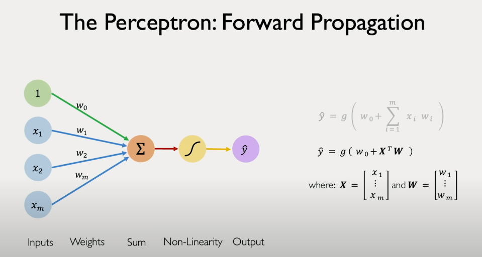
- 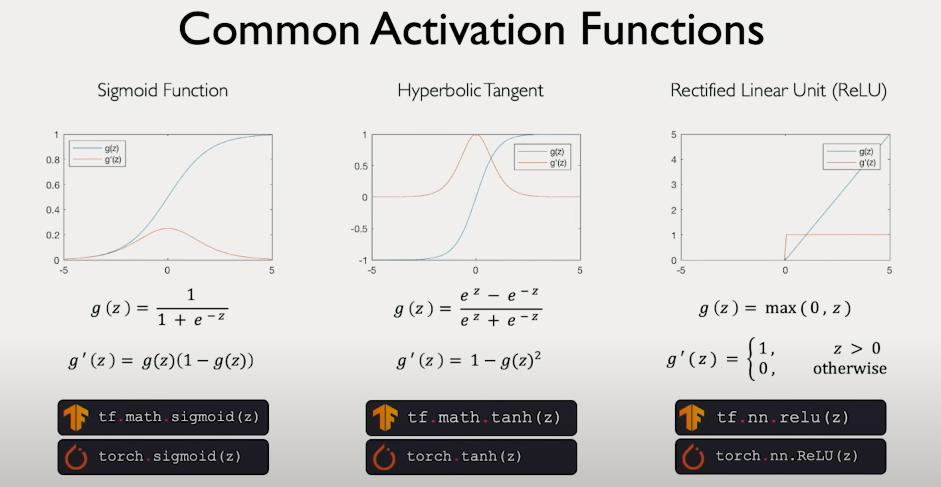
- activation functions - non-linear functions -- introduce non-linearities into network
- take bias, do dot product, apply non-linearity
- dense layers -- everything in input is connected to everything in output
- 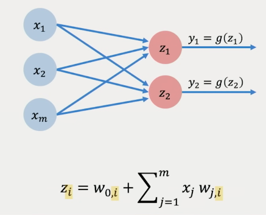
- 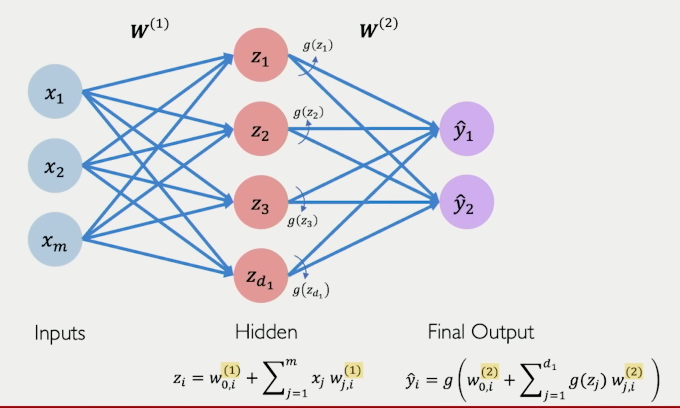
- As you get more and more complex tasks, you need more deep layers (more hidden layers)
- More output neurons is based on the outputs your problem solves. 
- neural networks - stacking perceptrons; optimization through backpropagation


<br/><br/>

- Quantifying loss - how bad/good the prediction is
- how far apart are the predictions are from ground truth
- loss of network measures cost incurred from incorrect predictions
- empirical loss measures total loss over our entire dataset -- average
- 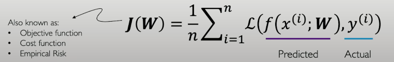
- minimize loss, maximize accuracy
- Cross entropy loss can be used with models that output a probability between 0 and 1
  - distance between two binary probability distributions
  - 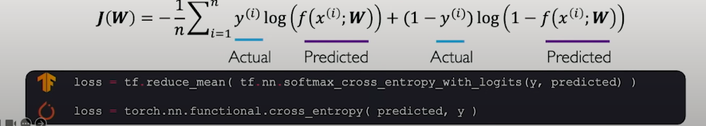
- Mean squared error loss can be used with regression models that output continuous real numbers
  - 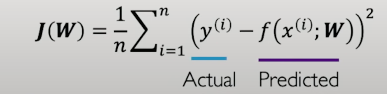


<br/><br/>

- loss optimization
- Gradient Descent
  - initialize random weights
  - loop until convergence
    - compute gradient (which way to go)
    - update weights w <- w - eta (dJ(w)/dw)
  - return weights
- we compute gradient using back propagation
- 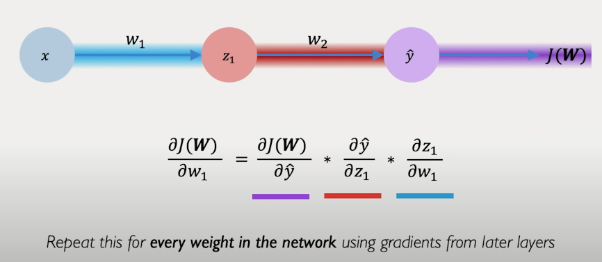
- eta is called learning rate (how quickly/big step do you take)
  - too small - local minima
  - too big - never converges
- how to set eta
  - try different values
  - adaptive learning rate - adapts to landscape
    - how large gradient is 
    - how fast learning is happening
    - size of particular weights
    - ...
  - algorithms
    - SGD
    - Adam
    - Adadelta
    - Adagrad
    - RMSProp


<br/><br/>

- Stochastic Gradient Descent
  - intialize weights randomly
  - loop until converge
    - pick single data point | pick a batch of b data points -- this is where stochasticity comes from
    - compute gradient
    - update weights
  - return weights
- overfitting - too complex, extra parameters, does not generalize well
- underfitting - model does not have capacity to fully learn the data
- regularization - technique that constraints optimization problem to discourage complex models
  - Dropout - during training, randomly set some activations to 0
  - Early Stopping - stop training before we have a chance to overfit


### [Recurrent Neural Netowkrs, Transformers, and Attention](https://introtodeeplearning.com/slides/6S191_MIT_DeepLearning_L2.pdf)

- Sequence modeling
- 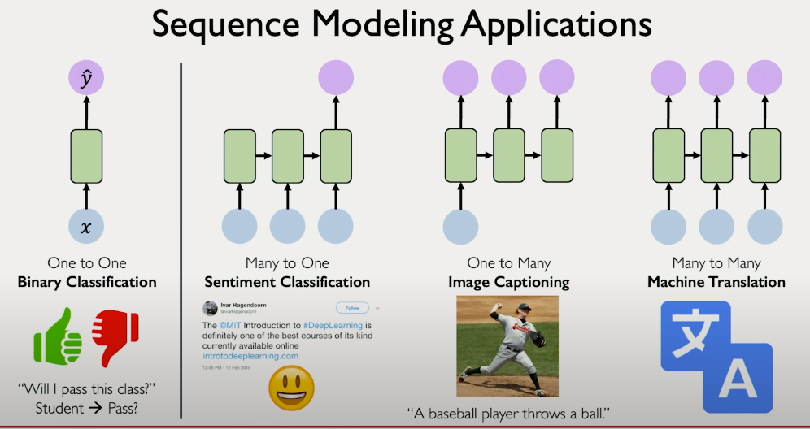
- 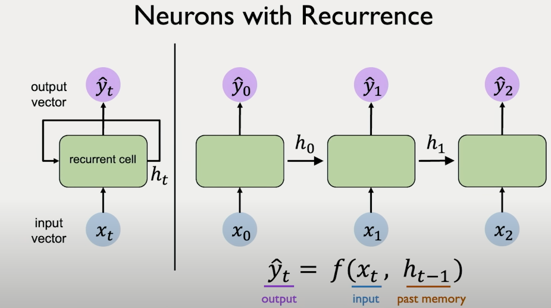
- 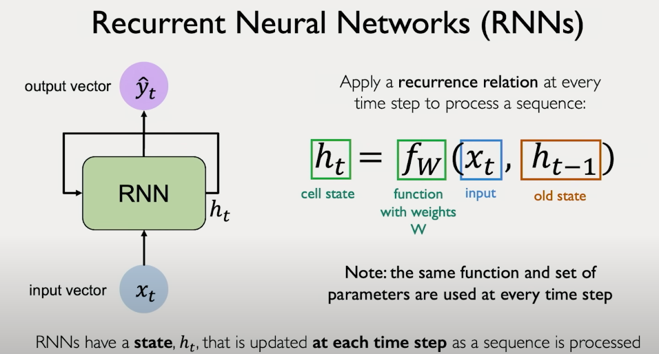
- 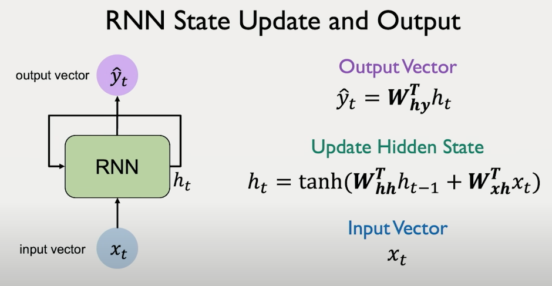
- 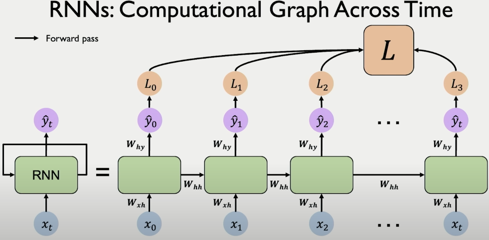

<br/><br/>

- sequence modeling design criteria
  - handle variable-length sequences
  - track long-term dependencies
  - maintain information about order
  - share parameters across sequence

<br/><br/>

- predict next workd
- representing language to a neural network
- neural networks require numerical inputs, cannot interpret words
- embedding - transforming index into a vector of fixed size
- vocabulary - corpus of words
- indexing - word to index
- embedding - index to fixed-sized vector
  - one-hot embedding - one 1 and rest 0s -- corresponding is one
  - learned embedding
- 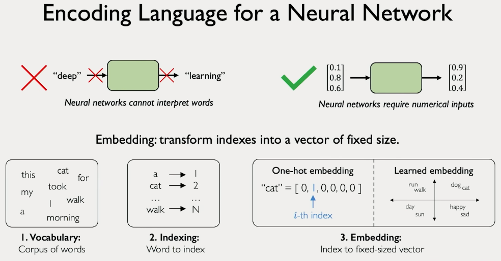


<br/><br/>

- Back Propagation Through Time BPTT
- Back Propagation
  - take derivative(gradient) of the loss with respect to each parameter
  - shift parameters in order to minimize loss
- 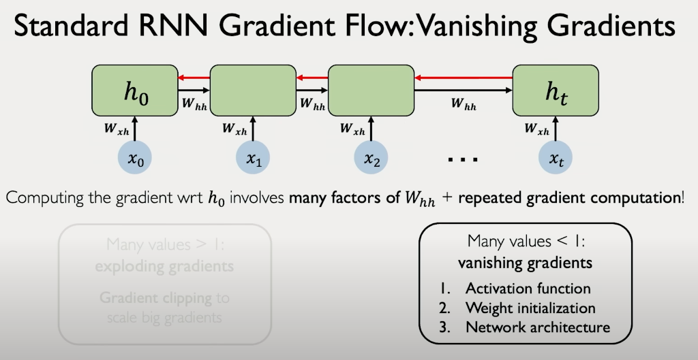
- 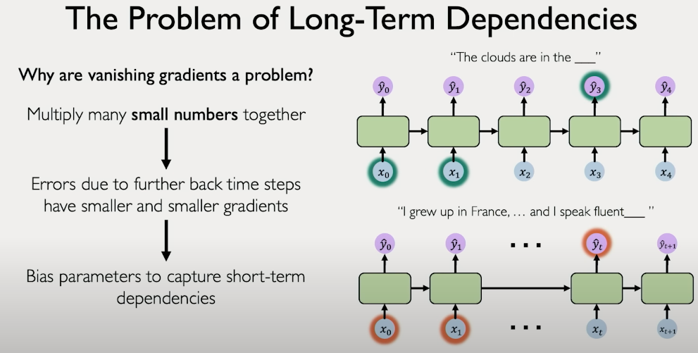
- Because of the vanishing gradients, some of the information in early stages/layers can't be retained
- So, they started thinking of adding something for each layer, to retain additional information and pass it to next -- adding complexity to RNN unit itself effectively adding additional functions to try to selectively control the amount of information that is passed to the update of the hidden state. 
- 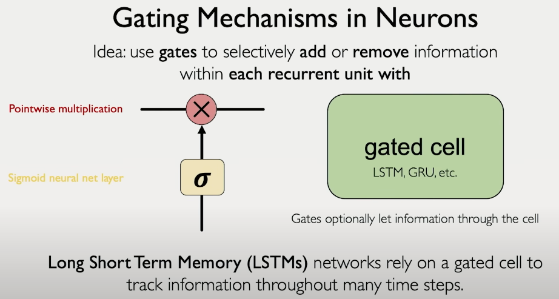
- LSTM Long Short Term Memory
- limitations of RNN
  - encoding bottleneck -- h(t)
  - slow, no parallelization -- sequence dependence
  - not long memory
- idea 1: we don't process our sequence in timesteps. say, we concatenate into one continuous stream, feed everything into one dense network or feed forward neural network
  - not scalable
  - no order
  - no long memory -- earlier, later, 
- idea 2: identify and attend to what's important
  - define a mechanism that can, on it's own, pick out and look at the parts of the infromation that are important/relative to other parts. 
  - attention is all you need -- 2017
- Transformer is a type of neural network architecture


<br/><br/>

- Attention is all you need
  - identify which parts to attend to -- similar to a search problem
    - Query(Q)
    - Keys (K1, K2, ...)
    - Compute attention mask: how similar is each key to the desired query
  - extract the features with high attention
    - Extract values based on attention -- return values with highest attention
- 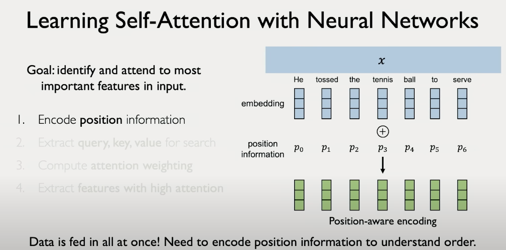
- we use three neural networks to produce three sets of matrices (query, key, value)
- 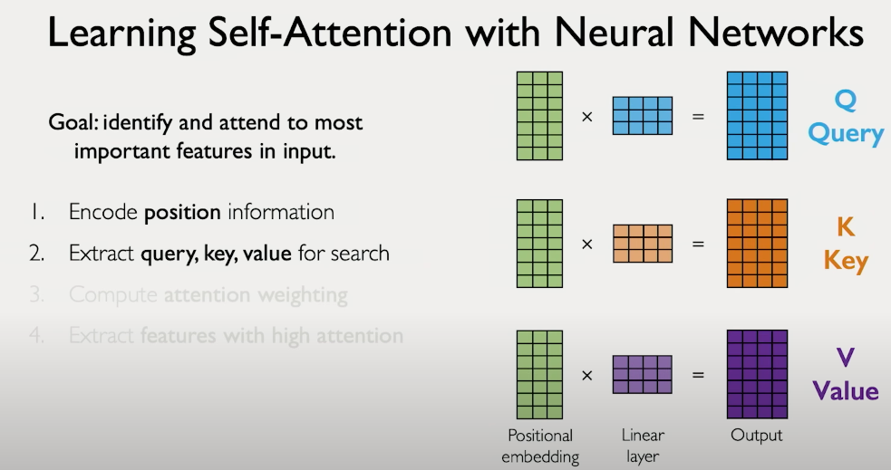
- Attention Score: compute pairwise similarity between each query and key
- 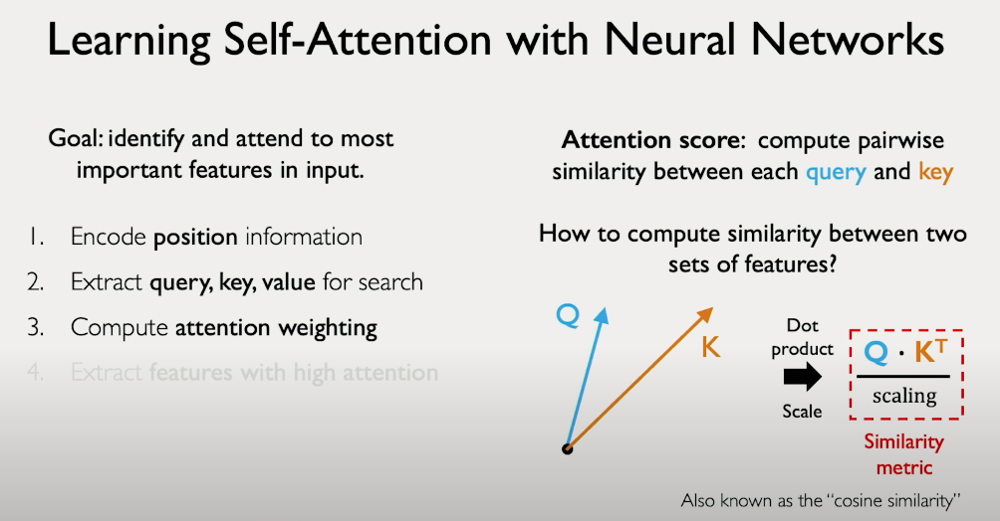
- softmax - squish values between 0 and 1
- 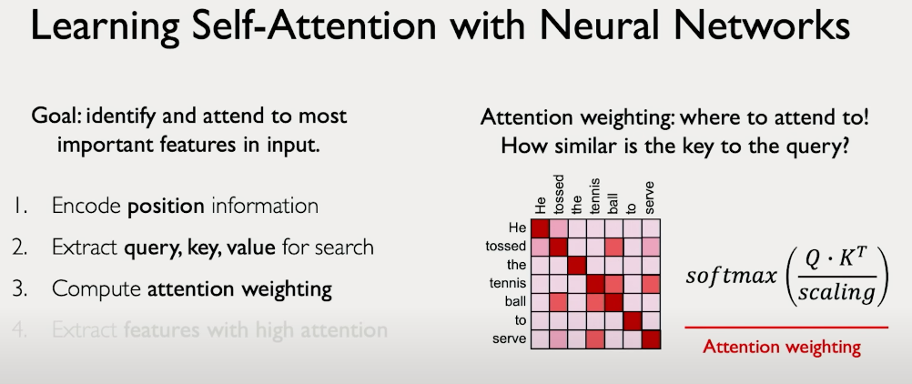
- 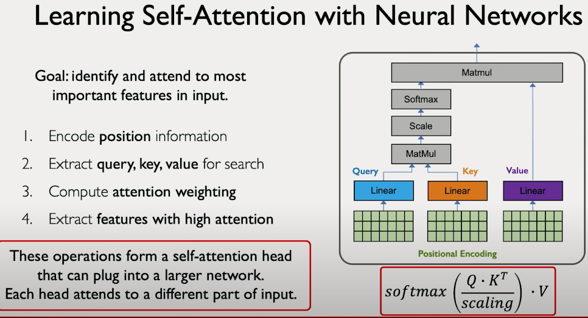

<br/><br/>

- self-attention applications
  - language processing
  - biological sequences -- protein structure models
  - computer vision -- vision transformers
- summary
  - RNNs are well suited for sequence modeling tasks
  - Model sequences via recurrence relation -- h(t) BPTT
  - Training RNNs with BPTT
  - Models for music generation, classification, machine translation, and more
  - Self-attention to model sequences without recurrence
  - Self-attention is the basis for many LLMs


### [Convolutional Neural Networks](https://youtu.be/oGpzWAlP5p0?si=FXvR_kWyWik7Et8v)

- Vision: a sense
  - what is where  
  - how things are moving - dynamics
    - stopped cars, moving cars
  - interpreting holistically
- images are numbers
- regression - output variable takes continuous value
- classification - output variable takes class label
- high level feature detection
- 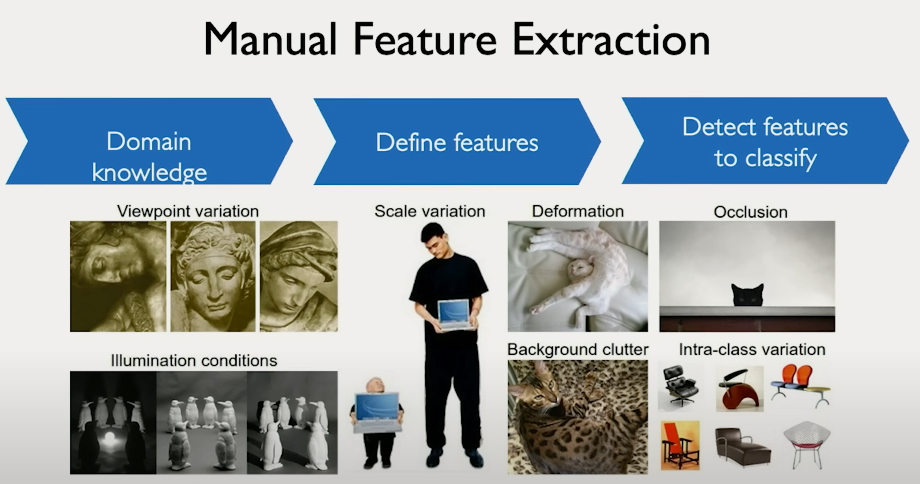
- defining features in ML is human (manual), where as in Deep Learning, we let the data define
- 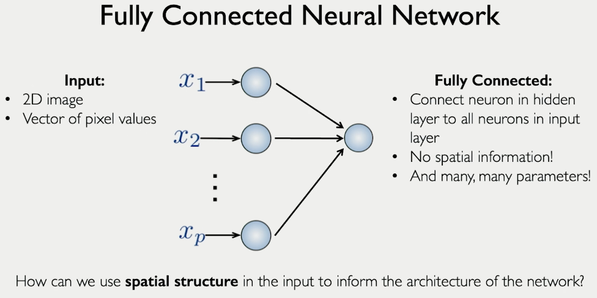
- 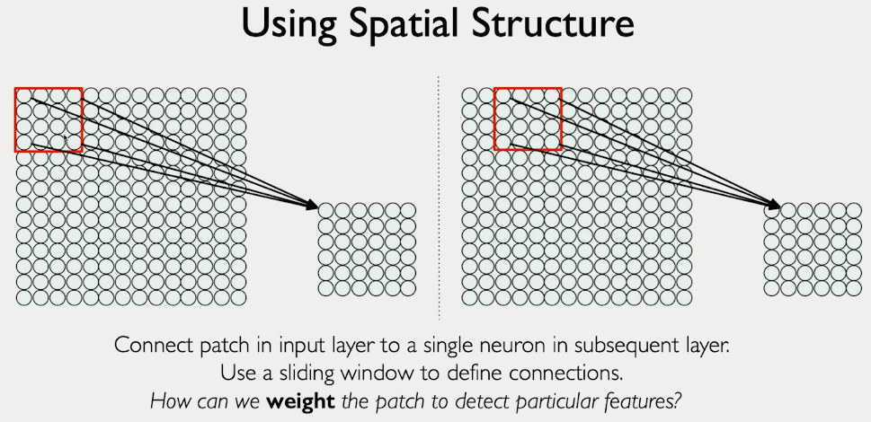
  - everything is not connected to everything
- 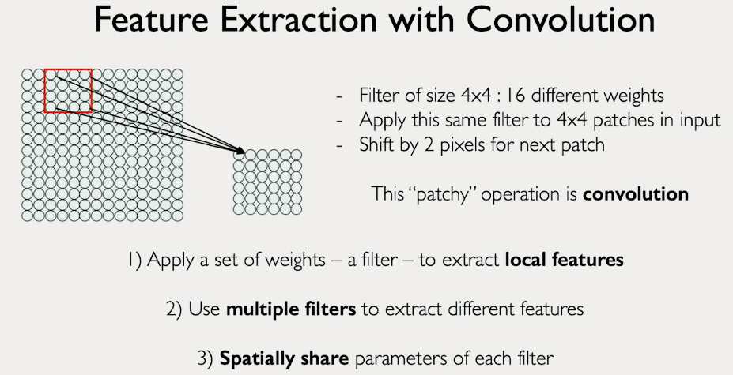
- 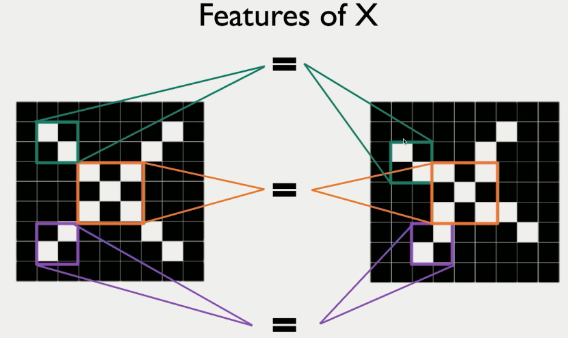
- 
- 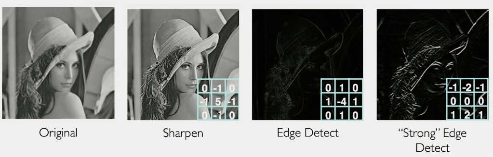
  - hand engineered feature maps | filters


<br/><br/>

- Convolution (apply filters to generate feature maps) > Non-linearity (Often ReLU) > Pooling (Downsampling operation on each feature map)
- 

### [Deep Generative Modeling](https://youtu.be/SdTZAMDKrNY?si=z_r7k-M5tKqoDz_P)

</details>

--------

<br/><br/>


<details open>
<summary> 2018 </summary>

### Introduction to Deep Learning


### Sequence Modeling with Neural Networks


### Convolutional Neural Networks


### Deep Generative Modeling


### Deep Reinforcement Modeling


### Deep Learning Limitations and New Frontiers


### Issues in Image Classification


### Faster ML Development with TensorFlow


### Deep learning - A personal perspective


### Beyond Deep Learning: Learning + Reasoning


### Computer Vision Meets Social Networks

</details>

--------

<br/><br/>


## CodeAcademy: Deep Learning with TensorFlow Image Classification

- Convolution layers: designed to process image data by focusing on local relationships between features
- [Chest X-Ray Pneumonia dataset](https://www.kaggle.com/datasets/paultimothymooney/chest-xray-pneumonia)

```py
from tensorflow.keras.preprocessing.image ImageDataGenerator

training_data_generator = ImageDataGenerator(
  resclae = 1.0/255, # normalizes pixel values into 0-1
  zoom_range = 0.2, # randomly increase or decrease size of image by 20%
  rotation_range = 15, # -15, 15 degrees 
  width_shift_range = 0.05, # 5% 
  height_shift_range = 0.05
  ) 


DIRECTORY = "data/train"
CLASS_MODE = "categorical" # categorical => one-hot encoding
COLOR_MODE = "grayscale" # or rgb
TARGET_SIZE = (256,256) # will be resized into this
BATCH_SIZE = 32

training_iterator = training_data_generator.flow_from_directory(
  DIRECTORY,
  class_mode=CLASS_MODE,
  color_mode=COLOR_MODE,
  target_size=TARGET_SIZE,
  batch_size=BATCH_SIZE
  ) # DirectoryIterator object

sample_batch_input,sample_batch_labels  = training_iterator.next()

print(sample_batch_input.shape,sample_batch_labels.shape)
# (32, 256, 256, 1) (32, 2)
```


<br/><br/>

```py
import tensorflow as tf

model = tf.keras.Sequential()

model.add(tf.keras.Input(shape = (256, 256)))
model.add(tf.keras.layers.Flatten()) # 1D vector of 65536 features
model.add(tf.keras.layers.Dense(100, activation="relu"))
model.add(tf.keras.layers.Dense(50, activation="relu"))
model.add(tf.keras.layers.Dense(2, activation="softmax"))

model.summary() # 6.5 million trainable params

# above uses flatten to send one large array 256 x 256 x 1 as a long feature vector
```


<br/><br/>

- smaller weight tensors -- filters -- kernels
- move/convolve across height and width of input
- filters compute new features by only combining features that are near to each other -- look for local patterns (edges and objects)
- parmeters = number of filters x (input channels x height x width + 1)

```py
import tensorflow as tf

model = tf.keras.Sequential()
model.add(tf.keras.Input(shape=(256, 256, 1)))

#Adds a Conv2D layer with 16 filters, each size 7x7:
model.add(tf.keras.layers.Conv2D(16, 7,activation="relu"))
model.summary()
```

- Stride -- hyperparameter -- how much we move filter each time we apply it -- default is 1
- strider > 1 -- do not apply filter centered on every pixel
- Padding -- hyperparameter -- what we do once filter reaches end of row/col
  - valid padding -- stop
  - same padding -- keep going -- pad input by surrounding with zeroes
    - output feature map has same height and width as input
    - outputsize = x - (filter size - 1) => `256 - (7 - 1)`  

```py
model.add(
  tf.keras.layers.Conv2D(
    16, # filters
    7, # filter size
    strides=2,
    padding="valid",
    activation="relu"
  )
)

model.summary()
```

```py
# Can stack conv layers
model.add(tf.keras.layers.Conv2D(8, 5, strides=3, activation="relu"))
model.add(tf.keras.layers.Conv2D(4, 3, strides=3, activation="relu"))
model.add(tf.keras.layers.Conv2D(2, 2, strides=2, activation="relu"))

# number of filters in prev layer become number of channels in next
```


<br/><br/>

```py
import tensorflow as tf

model = tf.keras.Sequential()

model.add(tf.keras.Input(shape=(256,256,1)))
model.add(tf.keras.layers.Conv2D(2, 5, strides=3, activation="relu"))
model.add(tf.keras.layers.Conv2D(4, 3, strides=1, activation="relu"))
model.add(tf.keras.layers.Flatten())
model.add(tf.keras.layers.Dense(2,activation="softmax"))

model.summary()
```

- Pooling layers -- reduce dimensionality of intermediate output results; reduce overfitting; provide translational invariance (even if move objects in image, output will be same)
- Max pooling
  - instead of multiplying each image patch with a filter, we replace the patch with its maximum value

```py
max_pool_2d = tf.keras.layers.MaxPooling2D(pool_size=(3, 3),   strides=(3, 3), padding='valid')
```

- Area Under Curve gives relationship between true positives and false positives

```py
from tensorflow.keras.preprocessing.image import ImageDataGenerator
import tensorflow as tf

BATCH_SIZE = 16

print("\nLoading training data...")

training_data_generator = ImageDataGenerator(
        rescale=1./255,
        zoom_range=0.2,
        rotation_range=15,
        width_shift_range=0.05,
        height_shift_range=0.05)

training_iterator = training_data_generator.flow_from_directory(
  'data/train',
  class_mode='categorical',
  color_mode='grayscale',
  batch_size=BATCH_SIZE
)

print("\nLoading validation data...")

validation_data_generator = ImageDataGenerator(rescale=1./255)

validation_iterator = validation_data_generator.flow_from_directory(
  'data/test', 
  class_mode='categorical', 
  color_mode='grayscale', 
  batch_size = BATCH_SIZE
)

print("\nBuilding model...")

model = tf.keras.Sequential()
model.add(tf.keras.Input(shape=(256, 256, 1)))
model.add(tf.keras.layers.Conv2D(2, 5, strides=3, activation="relu")) 
model.add(tf.keras.layers.MaxPooling2D(
    pool_size=(5, 5), strides=(5,5)))
model.add(tf.keras.layers.Conv2D(4, 3, strides=1, activation="relu")) 
model.add(tf.keras.layers.MaxPooling2D(
    pool_size=(2,2), strides=(2,2)))
model.add(tf.keras.layers.Flatten())

model.add(tf.keras.layers.Dense(2,activation="softmax"))

model.summary()


print("\nCompiling model...")


model.compile(
   optimizer=tf.keras.optimizers.Adam(learning_rate=0.005),
   loss=tf.keras.losses.CategoricalCrossentropy(),
   metrics=[tf.keras.metrics.CategoricalAccuracy(),tf.keras.metrics.AUC()]
)

print("\nTraining model...")

model.fit(
       training_iterator,
       steps_per_epoch=training_iterator.samples/BATCH_SIZE,
       epochs=5,
       validation_data=validation_iterator,
       validation_steps=validation_iterator.samples/BATCH_SIZE
)
```


- feature maps -- result of convolving a single filter across our input
- in the initial layers, when we look at feature maps, we notice that the model tries to learn the structure, vertical and horizontal edges
- as we go deeper, the feature maps get blurred


<br/><br/>

```py
# utils.py
import requests
import io
import numpy as np
import os

#Loads data from url
def make_request(url):
    print("Requesting data from {}...".format(url))
    response = requests.get('https://content.codecademy.com/courses/deeplearning-with-tensorflow/'+url)
    response.raise_for_status()
    response_data = io.BytesIO(response.content)
    return response_data
    
#Loads galaxy data
def load_galaxy_data():
  
  #If cached file not found, loads data from url
  if not os.path.isfile('./cached_data.npz'):
     response_data = make_request(url='galaxydata.npz')

     with open("cached_data.npz","wb") as save_file:
      save_file.write(response_data.read())
 
  #Load data using NumPy
  data = np.load('cached_data.npz')

  print("Successfully loaded galaxy data!")
  
  return data["data"],data["labels"]
```

```py
# Classifying Galaxies

import tensorflow as tf
from tensorflow.keras.preprocessing.image import ImageDataGenerator

from sklearn.model_selection import train_test_split
from utils import load_galaxy_data

input_data, labels = load_galaxy_data()
print(input_data.shape) # last dimension indicates number of channels
print(labels.shape) # last dimension indicates number of classes

x_train, x_valid, y_train, y_valid = train_test_split(
  input_data, 
  labels, 
  test_size=0.20, 
  shuffle=True, 
  random_state = 222, 
  stratify = labels # ensures ratio of galaxies in testing is same as original dataset
)

data_generator = ImageDataGenerator(rescale=1./255)

training_iterator = data_generator.flow(x_train, y_train, batch_size = 5)
validation_iterator = data_generator.flow(x_valid, y_valid, batch_size = 5)

model = tf.keras.Sequential()
model.add(tf.keras.Input(shape=(128, 128, 3)))
model.add(tf.keras.layers.Conv2D(8, 3, strides=2, activation="relu")) 
model.add(tf.keras.layers.MaxPooling2D(
    pool_size=(2, 2), strides=(2,2)))
model.add(tf.keras.layers.Conv2D(8, 3, strides=2, activation="relu")) 
model.add(tf.keras.layers.MaxPooling2D(
    pool_size=(2,2), strides=(2,2)))
model.add(tf.keras.layers.Flatten())
model.add(tf.keras.layers.Dense(16, activation="relu"))
model.add(tf.keras.layers.Dense(4, activation="softmax"))

model.summary()

model.compile(
  optimizer = tf.keras.optimizers.Adam(learning_rate = 0.001), 
  loss = tf.keras.losses.CategoricalCrossentropy(), 
  metrics = [tf.keras.metrics.CategoricalAccuracy(), tf.keras.metrics.AUC()]
)

model.fit(
  training_iterator, 
  steps_per_epoch = len(x_train) / 5, 
  epochs = 8, 
  validation_data = validation_iterator, 
  validation_steps = len(x_valid) / 5
)


from visualize import visualize_activations
visualize_activations(model,validation_iterator)

```