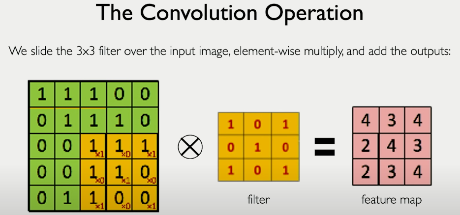

# [Deep Learning](../../courses.md)

- [Deep Learning](#deep-learning)
  - [MIT: Intro to Deep Learning](#mit-intro-to-deep-learning)
    - [Introduction to Deep Learning](#introduction-to-deep-learning)
    - [Recurrent Neural Netowkrs, Transformers, and Attention](#recurrent-neural-netowkrs-transformers-and-attention)
    - [Convolutional Neural Networks](#convolutional-neural-networks)
    - [Deep Generative Modeling](#deep-generative-modeling)
    - [Introduction to Deep Learning](#introduction-to-deep-learning-1)
    - [Sequence Modeling with Neural Networks](#sequence-modeling-with-neural-networks)
    - [Convolutional Neural Networks](#convolutional-neural-networks-1)
    - [Deep Generative Modeling](#deep-generative-modeling-1)
    - [Deep Reinforcement Modeling](#deep-reinforcement-modeling)
    - [Deep Learning Limitations and New Frontiers](#deep-learning-limitations-and-new-frontiers)
    - [Issues in Image Classification](#issues-in-image-classification)
    - [Faster ML Development with TensorFlow](#faster-ml-development-with-tensorflow)
    - [Deep learning - A personal perspective](#deep-learning---a-personal-perspective)
    - [Beyond Deep Learning: Learning + Reasoning](#beyond-deep-learning-learning--reasoning)
    - [Computer Vision Meets Social Networks](#computer-vision-meets-social-networks)

## MIT: Intro to Deep Learning

 2025 

### [Introduction to Deep Learning](https://introtodeeplearning.com/slides/6S191_MIT_DeepLearning_L1.pdf)

- Intelligence - use data to inform future decisions
- AI - technic enabling mimicing human behavior
- ML - learn without programmed
- DL - extract patterns from data

  

- Skills
  - TensorFlow
  - PyTorch
- Labs
  - Music Generation
  - Computer Vision
  - LLMs
- Why DL?
  - hand engineered features are time consuming 
  - low level features - lines and edges
  - mid level features - eyes nose, ears
  - high level features - faces
- Why Now?
  - Big Data - easy storage and collection
  - Hardware - Graphics Processing Unit GPUs, Parallelizable
  - Software - Keras, TensorFlow, PyTorch

  

- Perceptron -- structural building blocks; non-linear activation
- 
- 
- activation functions - non-linear functions -- introduce non-linearities into network
- take bias, do dot product, apply non-linearity
- dense layers -- everything in input is connected to everything in output
- 
- 
- As you get more and more complex tasks, you need more deep layers (more hidden layers)
- More output neurons is based on the outputs your problem solves. 
- neural networks - stacking perceptrons; optimization through backpropagation

  

- Quantifying loss - how bad/good the prediction is
- how far apart are the predictions are from ground truth
- loss of network measures cost incurred from incorrect predictions
- empirical loss measures total loss over our entire dataset -- average
- 
- minimize loss, maximize accuracy
- Cross entropy loss can be used with models that output a probability between 0 and 1
  - distance between two binary probability distributions
  - 
- Mean squared error loss can be used with regression models that output continuous real numbers
  - 

  

- loss optimization
- Gradient Descent
  - initialize random weights
  - loop until convergence
    - compute gradient (which way to go)
    - update weights w <- w - eta (dJ(w)/dw)
  - return weights
- we compute gradient using back propagation
- 
- eta is called learning rate (how quickly/big step do you take)
  - too small - local minima
  - too big - never converges
- how to set eta
  - try different values
  - adaptive learning rate - adapts to landscape
    - how large gradient is 
    - how fast learning is happening
    - size of particular weights
    - ...
  - algorithms
    - SGD
    - Adam
    - Adadelta
    - Adagrad
    - RMSProp

  

- Stochastic Gradient Descent
  - intialize weights randomly
  - loop until converge
    - pick single data point | pick a batch of b data points -- this is where stochasticity comes from
    - compute gradient
    - update weights
  - return weights
- overfitting - too complex, extra parameters, does not generalize well
- underfitting - model does not have capacity to fully learn the data
- regularization - technique that constraints optimization problem to discourage complex models
  - Dropout - during training, randomly set some activations to 0
  - Early Stopping - stop training before we have a chance to overfit

### [Recurrent Neural Netowkrs, Transformers, and Attention](https://introtodeeplearning.com/slides/6S191_MIT_DeepLearning_L2.pdf)

- Sequence modeling
- 
- 
- 
- 
- 

  

- sequence modeling design criteria
  - handle variable-length sequences
  - track long-term dependencies
  - maintain information about order
  - share parameters across sequence

  

- predict next workd
- representing language to a neural network
- neural networks require numerical inputs, cannot interpret words
- embedding - transforming index into a vector of fixed size
- vocabulary - corpus of words
- indexing - word to index
- embedding - index to fixed-sized vector
  - one-hot embedding - one 1 and rest 0s -- corresponding is one
  - learned embedding
- 

  

- Back Propagation Through Time BPTT
- Back Propagation
  - take derivative(gradient) of the loss with respect to each parameter
  - shift parameters in order to minimize loss
- 
- 
- Because of the vanishing gradients, some of the information in early stages/layers can't be retained
- So, they started thinking of adding something for each layer, to retain additional information and pass it to next -- adding complexity to RNN unit itself effectively adding additional functions to try to selectively control the amount of information that is passed to the update of the hidden state. 
- 
- LSTM Long Short Term Memory
- limitations of RNN
  - encoding bottleneck -- h(t)
  - slow, no parallelization -- sequence dependence
  - not long memory
- idea 1: we don't process our sequence in timesteps. say, we concatenate into one continuous stream, feed everything into one dense network or feed forward neural network
  - not scalable
  - no order
  - no long memory -- earlier, later, 
- idea 2: identify and attend to what's important
  - define a mechanism that can, on it's own, pick out and look at the parts of the infromation that are important/relative to other parts. 
  - attention is all you need -- 2017
- Transformer is a type of neural network architecture

  

- Attention is all you need
  - identify which parts to attend to -- similar to a search problem
    - Query(Q)
    - Keys (K1, K2, ...)
    - Compute attention mask: how similar is each key to the desired query
  - extract the features with high attention
    - Extract values based on attention -- return values with highest attention
- 
- we use three neural networks to produce three sets of matrices (query, key, value)
- 
- Attention Score: compute pairwise similarity between each query and key
- 
- softmax - squish values between 0 and 1
- 
- 

  

- self-attention applications
  - language processing
  - biological sequences -- protein structure models
  - computer vision -- vision transformers
- summary
  - RNNs are well suited for sequence modeling tasks
  - Model sequences via recurrence relation -- h(t) BPTT
  - Training RNNs with BPTT
  - Models for music generation, classification, machine translation, and more
  - Self-attention to model sequences without recurrence
  - Self-attention is the basis for many LLMs

### [Convolutional Neural Networks](https://youtu.be/oGpzWAlP5p0?si=FXvR_kWyWik7Et8v)

- Vision: a sense
  - what is where  
  - how things are moving - dynamics
    - stopped cars, moving cars
  - interpreting holistically
- images are numbers
- regression - output variable takes continuous value
- classification - output variable takes class label
- high level feature detection
- 
- defining features in ML is human (manual), where as in Deep Learning, we let the data define
- 
- 
  - everything is not connected to everything
- 
- 
- 
- 
  - hand engineered feature maps | filters

  

- Convolution (apply filters to generate feature maps) > Non-linearity (Often ReLU) > Pooling (Downsampling operation on each feature map)
- 

### [Deep Generative Modeling](https://youtu.be/SdTZAMDKrNY?si=z_r7k-M5tKqoDz_P)

--------

  

 2018 

### Introduction to Deep Learning

### Sequence Modeling with Neural Networks

### Convolutional Neural Networks

### Deep Generative Modeling

### Deep Reinforcement Modeling

### Deep Learning Limitations and New Frontiers

### Issues in Image Classification

### Faster ML Development with TensorFlow

### Deep learning - A personal perspective

### Beyond Deep Learning: Learning + Reasoning

### Computer Vision Meets Social Networks

--------

  
