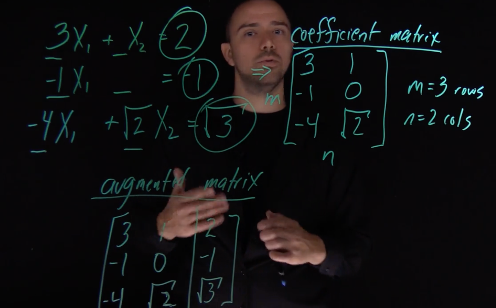

# UCB Essential Math Specialization

## Algebra and Differential Calculus for Data Science

Functions -- f(x) = x^2 + 1 
- say, you have a circle in a 2 d graph touching all axes, it can't be represented using a function (x) because for a given x, it doesn't know what to output, indeterminant

Domain -- allowed values
Range -- all possible outputs

Piecewise Functions -- does diff things based on input --> f(x) = x^2 + 39 if x >=0 x + 39 if x < 0

Muliplying binomials -- `(x^2 + x + 1) (x + 39)`
Pascals triangle
- `0 0 1 0 0`
- `.0 1 1 0 `
- `0 1 2 1 0` - 1.x^2 + 2.xy + 1.y^2
- `.1 3 3 1 ` - 1.x^3 + 3.x^2y + 3.xy^2 + y^3

  

Rationalizing denominators
$\frac{1}{\sqrt{x+1}} \cdot \frac{\sqrt{x+1}}{\sqrt{x+1}}$

  

Exponent Rules

$a^m \cdot a^n = a^{m+n}$

$\frac{a^m}{a^n} = a^{m-n}, \quad a \neq 0$

$(a^m)^n = a^{m \cdot n}$

$(a \cdot b)^m = a^m \cdot b^m$

$\left(\frac{a}{b}\right)^m = \frac{a^m}{b^m}, \quad b \neq 0$

$a^0 = 1, \quad a \neq 0$

$a^{-m} = \frac{1}{a^m}, \quad a \neq 0$

$a^{m/n} = \sqrt[n]{a^m} = (\sqrt[n]{a})^m$

  

Logarithm Rules -- solving for exponents

$\log_b(MN) = \log_b(M) + \log_b(N)$

$\log_b\left(\frac{M}{N}\right) = \log_b(M) - \log_b(N)$

$\log_b(M^p) = p \cdot \log_b(M)$

$\log_b(M) = \frac{\log_c(M)}{\log_c(b)}$

$\log_b(1) = 0$

$\log_b(b) = 1$

$b^{\log_b(M)} = M$

$\log_b(b^p) = p$

  

Proof by Induction 
- Prove for base case n=1|0
- Assume it is true for k then it must be true for k+1

  

Limits at Infinity

$\lim_{x \to \infty} \frac{1}{x} = 0$

  

Limits at specific point
$f(x) = \begin{cases} x + 2 & \text{if } x < 1 \\ x^2 & \text{if } x \ge 1 \end{cases}$

$\lim_{x \to 1^-} f(x) = \lim_{x \to 1^-} (x + 2) = 1 + 2 = 3$

$\lim_{x \to 1^+} f(x) = \lim_{x \to 1^+} (x^2) = (1)^2 = 1$

$\lim_{x \to 1^-} f(x) \neq \lim_{x \to 1^+} f(x) \implies \lim_{x \to 1} f(x) \text{ does not exist.}$

$\lim_{x \to \infty} \frac{1}{x} = 0$

$\lim_{x \to 0^-} \frac{1}{x} = -\infty$

$\lim_{x \to 0^+} \frac{1}{x} = +\infty$

$\lim_{x \to 0^-} \frac{1}{x} \neq \lim_{x \to 0^+} \frac{1}{x} \implies \lim_{x \to 0} \frac{1}{x} \text{ does not exist.}$

  

Continuity of a function -- not picking up pen when drawing, no skip in graph
continuous -- defined + limits (left and right) agree / match

  

Derivatives -- slope of curve -- slope of tanget at a point

$f'(x) = \lim_{h \to 0} \frac{f(x+h) - f(x)}{h}$

$m = \frac{\text{change in } y}{\text{change in } x} = \frac{\text{rise}}{\text{run}} = \frac{y_2 - y_1}{x_2 - x_1}$

$\frac{d}{dx}(e^x) = e^x$

$\lim_{h \to 0} \frac{e^h - 1}{h} = 1$

  

L'Hôpital's Rule

If $\lim_{x \to c} f(x) = 0$ and $\lim_{x \to c} g(x) = 0$, OR if $\lim_{x \to c} f(x) = \pm\infty$ and $\lim_{x \to c} g(x) = \pm\infty$, then:

$\lim_{x \to c} \frac{f(x)}{g(x)} = \lim_{x \to c} \frac{f'(x)}{g'(x)}$

provided that the latter limit exists (or is $\pm\infty$). The point $c$ can be a finite number or $\pm\infty$.

  

The Taylor series of a function $f(x)$ that is infinitely differentiable at a point $a$ is given by:

$f(x) = \sum_{n=0}^{\infty} \frac{f^{(n)}(a)}{n!}(x-a)^n$

which can be expanded as:

$f(x) = f(a) + \frac{f'(a)}{1!}(x-a) + \frac{f''(a)}{2!}(x-a)^2 + \frac{f'''(a)}{3!}(x-a)^3 + \dots$

When $a = 0$, the series is called the **Maclaurin series**:

$f(x) = \sum_{n=0}^{\infty} \frac{f^{(n)}(0)}{n!}x^n$

$f(x) = f(0) + \frac{f'(0)}{1!}x + \frac{f''(0)}{2!}x^2 + \frac{f'''(0)}{3!}x^3 + \dots$

The Maclaurin series expansion for $e^x$ is:

$e^x = \sum_{n=0}^{\infty} \frac{x^n}{n!}$

which can be expanded as:

$e^x = 1 + x + \frac{x^2}{2!} + \frac{x^3}{3!} + \frac{x^4}{4!} + \dots$

  

Product Rule $(fg)' = f'g + fg'$

  

Quotient Rule

If $n = n(x)$ and $d = d(x)$ are differentiable functions, and $d(x) \neq 0$, then the derivative of their quotient $\frac{n}{d}$ is:

$\left(\frac{n}{d}\right)' = \frac{d \cdot n' - n \cdot d'}{d^2}$

  

Chain Rule

If $y = f(u)$ and $u = g(x)$, meaning $y$ is a function of $u$ and $u$ is a function of $x$, then the derivative of $y$ with respect to $x$ is:

$\frac{dy}{dx} = \frac{dy}{du} \cdot \frac{du}{dx}$

Alternatively, using prime notation:

If $h(x) = f(g(x))$, then the derivative $h'(x)$ is:

$h'(x) = f'(g(x)) \cdot g'(x)$

$\frac{d}{dx}(u^n) = n u^{n-1} u'$

  

Derivative of a function is 0 when the function hits maximum or minimum
Maxima, Minima, Peak, Valley

Positive derivative -- function goes uphill
Negative derivative -- function goes downhill

Using derivative to Graph

$f(x) = x^3 - 3x^2 + 2$
$f'(x) = 3x^2 - 6x = 3x(x-2)$
$f'(x) = 0 \text{ at } x = 0 \text{ or } x = 2$

| | $x<0$ | $0 < x < 2$ | $x > 2$ |
| :------- | :--------- | :--------- | :--------- |
| $x-2$  | $-$ | $-$ | $+$ |
| $3x$ | $-$ | $+$ | $+$ |
| $f'(x)$ | $+$ | $-$ | $+$ |
| $f(x)$ | Increasing | Decreasing | Increasing |

  

Concavity with Second Derivative

$f''(x) = 6x - 6 = 6(x-1)$

| | $x < 1$ | $x > 1$ |
| :------- | :--------- | :--------- |
| $6(x-1)$  | $-$ | $+$ |
| Concavity | Concave Down | Concave Up |

  

Absolute maxima, Absolute minima -- the fucntion has final max/min
Relative maxima, Relative minima -- the function keeps going, there's no one final max/min

Quadratic Roots $x = \frac{-b \pm \sqrt{b^2 - 4ac}}{2a}$

- how long should x be to get max box volume. 

- We can use first derivative to find maxima/minima
- We can use second derivative to find if it's maxima/minima without graphing function

  

Rate of Change. 
Derivative - how fast ys change with respect to xs

$\frac{\Delta y}{\Delta x} = \frac{y_2 - y_1}{x_2 - x_1}$

## Essential Linear Algebra for Data Science

Linear System

$a_1x_1 + a_2x_2 + \dots + a_nx_n = b$

- Only three possibilities
  - No Solution -- Parallel
  - One Solution -- Intersect
  - Infinite Solutions -- Same Line

Linear System -> Matrix
- Coefficient matrix -- m rows n cols
- Augmented matrix 

Rules of Gaussian Elimination GE and Solving a Linear System -- Augmented Matrix
1. Interchange 2 rows -- unlimited
2. Multiply row by non-zero constant
3. Add a multiple of one row to another

Solving the system using Gaussian Elimination:
Initial Augmented Matrix:

$\begin{pmatrix}
1 & -2 & 1 & | & 0 \\
0 & 2 & -8 & | & 8 \\
5 & 0 & -5 & | & 10
\end{pmatrix}$

---

Gaussian Elimination Steps:

$R_3 \to R_3 - 5R_1 \implies \begin{pmatrix} 1 & -2 & 1 & | & 0 \\ 0 & 2 & -8 & | & 8 \\ 0 & 10 & -10 & | & 10 \end{pmatrix}$

$R_2 \to \frac{1}{2}R_2$, $R_3 \to \frac{1}{10}R_3 \implies \begin{pmatrix} 1 & -2 & 1 & | & 0 \\ 0 & 1 & -4 & | & 4 \\ 0 & 1 & -1 & | & 1 \end{pmatrix}$

$R_3 \to R_3 - R_2 \implies \begin{pmatrix} 1 & -2 & 1 & | & 0 \\ 0 & 1 & -4 & | & 4 \\ 0 & 0 & 3 & | & -3 \end{pmatrix}$

---

Back Substitution:

From $R_3$: $3x_3 = -3 \implies x_3 = -1$

From $R_2$: $x_2 - 4x_3 = 4 \implies x_2 - 4(-1) = 4 \implies x_2 + 4 = 4 \implies x_2 = 0$

From $R_1$: $x_1 - 2x_2 + x_3 = 0 \implies x_1 - 2(0) + (-1) = 0 \implies x_1 - 1 = 0 \implies x_1 = 1$

---

Solution: $x_1 = 1, x_2 = 0, x_3 = -1$

  

Matrix Algebra 
- Multiply
  - $c_{ij} = \sum_{k=1}^{n} a_{ik}b_{kj}$
  - $(m \times \mathbf{n}) \cdot (\mathbf{n} \times p) = (m \times p)$
  - inner dimensions (**n**) should match -- only then we can multiply
- Add -- same dimensions
- Scale
- Identity Matrix -- multiplying a matrix by this matrix, does nothing. 

## Integral Calculus and Numerical Analysis for Data Science

