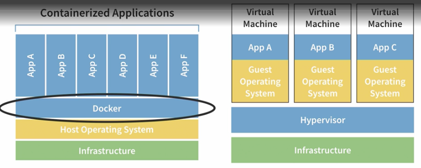
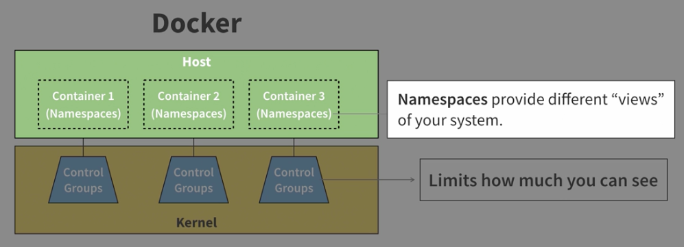
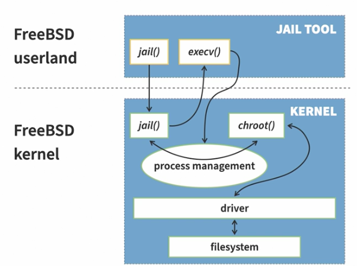
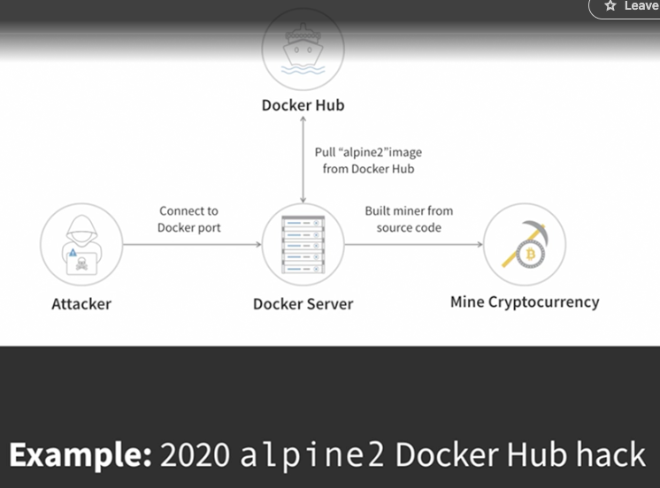
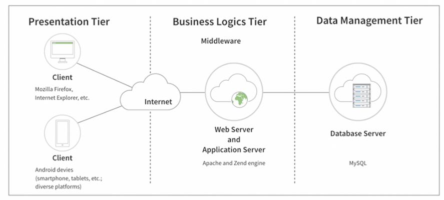
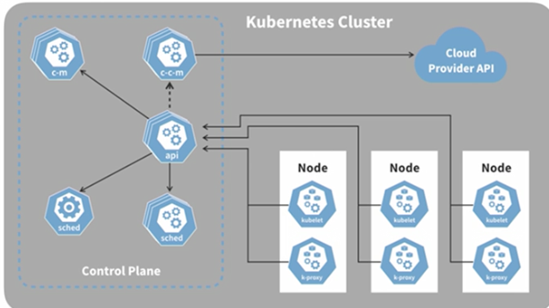
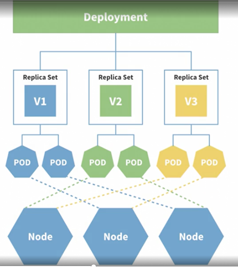
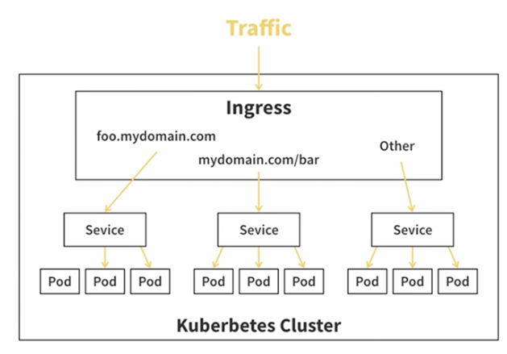

# [Docker](../../courses.md)


- [Docker](#docker)
  - [LinkedIn: Learning Docker](#linkedin-learning-docker)
    - [Introduction](#introduction)
    - [Installing Docker](#installing-docker)
    - [Using Docker](#using-docker)
    - [When Things go Wrong](#when-things-go-wrong)
    - [Additional Docker Resources](#additional-docker-resources)
  - [LinkedIn: Docker: Your First Project](#linkedin-docker-your-first-project)
    - [Intro](#intro)
    - [Pulling and Pushing Docker Images](#pulling-and-pushing-docker-images)
    - [Running Docker Containers](#running-docker-containers)
  - [LinkedIn: Learning Docker Compose](#linkedin-learning-docker-compose)
    - [Introduction](#introduction-1)
    - [Getting started with Docker Compose](#getting-started-with-docker-compose)
    - [Docker Compose Core Features](#docker-compose-core-features)
    - [Dynamic Configurations in Docker Compose](#dynamic-configurations-in-docker-compose)


## LinkedIn: Learning Docker

### Introduction 

- `cd ~` -- takes you home 
- `ls -a` 
- works on my machine!!! 
  - missing tools
  - different configuration
  - hardware dependencies
- solutions
  - configuration management
    - Chef, Puppet, Ansible
    - require hardware and OS knowledge
  - virtual machines as code
    - Vagrant
    - heavy, slowish
  - Docker
    - package apps as images
    - uses images and containers to run apps consistently, anywhere
    - images are created from lightweight config files
    - containers virtualize operating systems

Docker is a tool that enables running applications and their environments in containers. Apps in containers will run and behave the same anywhere that Docker is installed.

- 
- VM
  - use hypervisor to emulate hardware
  - can take up space
  - require you to install OS
  - can run multiple apps 
  - cannot interact with their hosts
- Containers
  - do not emulate hardware and do not boot-up
  - does not require OS installation
  - takes less space
  - can run only one app at a time 
  - can interact with their hosts -- can be a security issue



- Containers 
  - Linux Namespaces
    - provide view of the system (say File System) when it's operating inside a single folder
  - Linux Control Groups
    - limits how much hardware each process can use
    - monitor and restrict 
      - cpu usage
      - network and disk bandwidth
      - memory consumption
      - assign disk quotas -- not supported by docker; but usually we can use control groups to do this
- Linux Kernel provides 8 Namespaces
  - USERNS -- User Lists -- view and create users
  - MOUNT -- Access to file systems
  - NET -- Network Communication
  - IPC -- Inter Process Communication
  - TIME -- ability to change time -- not supported by docker. 
    - you can't change time in a docker container
  - PID -- Process ID Management
  - CGROUP -- create control groups
  - UTC -- create host/domain names

<br/><br/>

- Docker limitations
  - because control groups and namespaces are linux only features, docker natively only runs on linux, and on some windows 
  - container images are bound/tied to the parent operating systems (kernel they are created from) 
- Containers are old!
  - chroot()
    - Bill Joy created chroot() in 1979
    - added to 4.2 BSD in 1982
    - allows adminstrators to change what applications can 'see' even when running as root
  - BSD jails and Solaris Zones 
    - BSD jails merged into FreeBSD in 1999 and Solaris Zones in 2004
    - Allow administrator to create entire virtual environments for applications
    - 
  - Linux Containers LXC 2007 
    - brings BSD jail like functionality to Linux
    - create a mapping between user ID and user ID in a container, manually create a network bridge between LXCs network and yours, create config file, ...
- Docker Advantages
  - configuring and pacakging apps and their environments is easy -- Dockerfile
  - sharing images with world is easy -- Docker Hub
  - Starting apps in containers is easy -- Docker CLI 

### Installing Docker 

- Docker Machine: Uses Oracle's VirtualBox to create VMs that only run Docker Engine
  - Once created, users need to run a small shell script to connect Docker CLI with VM
  - Users needed to know VirtualBox, Virtual Machine, and VBoxManage
  - Slower than Docker on Linux
- 2016 Docker Desktop
  - Uses much smaller and more tightly integrated VMs called Virtual Kit (Apple's native) or Hyper-V (windows)
  - Handles volume and network port mapping
  - Nice GUI
- 2021 Mirantis -- Docker's parent company changed licensing 
- Docker Alternatives
  - Colima
  - Rancher Desktop
  - Podman

<br/><br/>


- Install `brew.sh`
- `brew install docker --cask` 
  - cask tells homebrew this package is maintained by open-source community instead of homebrew developers
- `docker run --rm hello-world`
  - retrieves hellow-world image and creates container 
  - --rm tells to remove container after it's done running app
- `docker` -- shows all supported commands
- `docker ps` -- list containers

- Linux
  - `sudo apt install curl`
  - `curl -o /tmp/get-docker.sh https://get.docker.com`
  - `sh /tmp/get-docker.sh`
  - `sudo docker run hello-world`
  - `sudo usermod -aG docker my_username` 
    - `$USER` gives username
  - `su -s $USER`
  - `sudo -u my_username sh`
  - `groups` -- list of all groups i am part of


### Using Docker 

- `docker --help` 
- `docker network --help`
- creating container
  - container images are compressed and pre-packaged file system that contains application along with environment and configuration, and instructions on how to start application : Entry Point
  - if image doesn't exist locally, docker tries to fetch it from container registry, Docker Hub; 
  - `docker container create hello-world:linux` :linux annotation is called image tag; doesn't start container
  - `docker ps` -- shows running containers
  - `docker ps -all` shows all containers
  - if status is Exited(0) -- it means entry point was likely executed without any issues
  - `docker container start container_id` -- starts container, returns container id
  - `docker logs first_few_chars_of_container_id`
  - `docker container start --attach container_id` start container and attach terminal as output
- creating container short way
  - `docker run hello-world:linux` -- creates container, starts, attaches output`
    - doesn't return container id though
  - `docker run = docker container create + docker container start + docker container attach`


<br/><br/>

```Dockerfile
FROM ubuntu 

LABEL maintainer="Vinay Danepalli <vdanepalli@gmail.com>"

USER root
# Potential Security Issue, So something like `USER nobody` works too 

COPY ./entrypoint.bash /
# Directory provided to docker build is called context (usually working dir)

RUN apt -y update
RUN apt -y install curl bash
RUN chmod 755 /entrypoint.bash

USER nobody
# sets defualt user for containers created from this image

ENTRYPOINT ["/entrypoint.bash"] 
# CMD can be used as well
```

- `docker build -t out-first-image --file app.DOckerfile`
- `docker build -t out-first-image .`
- `docker build -t out-first-image /path/to/entrypoint_or_app/`

- Docker images are just layers of images compressed together
- So, docker creates image for every command in dockerfile -- intermediary images
- `docker run our-first-image`


<br/><br/>

- `docker build --file server.Dockerfile --tag our-first-server .`
- `docker run our-server` -- terminal hangs
- Docker containers are not interactive by default
  - So if I were to press, Ctrl C/D/Z, it doesn't exit out of it
- `docker kill container_id` -- returns id of the killed container
- `docker run -d our-server`
  - creates, and starts container, but doesn't attach termnial to it
- `docker exec container_id command_to_run`
- `docker exec container_id date`
- `docker exec --interactive --tty container_id shell_i_want_to_use`
- `docker exec --interactive --tty container_id bash`
- `docker stop container_id` docker attempts to gracefully stop; greedier applications might not be kind, and not stop
- `docker stop -t 0 container_id` immediately or forcefully stop container
- `docker rm container_id` -- doesn't remove running containers
- `docker rm -f container_id` -- removes container even if it is running
- `docker ps -aq` only shows container ids
- `docker ps -aq | xargs docker rm` -- removes all stopped containers
- `docker images` -- lists images
- `docker rmi image-name` 
- `docker rmi -f image-name`


<br/><br/>

- `docker build -t our-web-server -f web-server.Dockerfile  .`
- `docker run -d --name our-web-server our-web-server` names container
- `docker logs our-web-server`
- `docker run -d --name our-web-server -p 5001:5000 our-web-server` --- portOutside:portInside mapping
- `docker run --rm --entrypoint sh image_name -c "echo 'Hello there.' > /tmp/file && cat /tmp/file"`
- `docker run --rm --entrypoint sh -v /tmp/container:/tmp image_name -c "echo 'Hello there.' > /tmp/file && cat /tmp/file"`


<br/><br/>

- you can map local files to containers file system, but if you try to mount non existing file, it mounts as a dir
- `touch /tmp/change_file`
- `docker run --rm --entrypoint sh -v /tmp/change_file:/tmp/file ubuntu -c "echo 'Hello There.' > /tmp/file && cat /tmp/file"`
- `cat /tmp/change_file` -- prints fine
- `docker run --rm --entrypoint sh -v /tmp/this_does_not_exist:/tmp/file ubuntu -c "echo 'Hello There.' > /tmp/file && cat /tmp/file"`
  - errors saying `cannot create /tmp/file: Is a directory`
  - also, if you look for this_does_not_exist locally, it now exists as a dir!!!


<br/><br/>

- Contianer Registries
- container image tags consist name of the string, a colon, and its version, or latest if not provided
  - `ubuntu:kinetic`
- `docker login`
- `docker tag my-existing-img-name username/my-new-img-name:0.0.1`
- `docker push username/my-new-img-name:0.0.1`


<br/><br/>

- `docker run --name website -v "$PWD/website:/usr/share/nginx/html" -p 8080:80 --rm nginx`
- `docker ps -a`

### When Things go Wrong 

- `docker rmi image1 image2 image3 ...`
- `docker system prune`
  - removes stopped containers, unused networks, ...
- slow running containers
  - `docker run --name=alpine -d --entrypoint=sleep alpine infinity` infinity is argument to sleep
  - `docker stats container_id_or_name`
  - `docker exec -i -t alpine sh`
    - -t lets local terminal to communicate with the container's terminal
  - `yes` prints y indefinitely
  - `docker exec -d alpine sleep infinity`
  - `docker exec -d alpine sleep infinity`
  - `docker exec -d alpine sleep infinity`
  - `docker top alpine`
  - `docker inspect alpine` -- returns json
  - `docker inspect apline | less` -- allows paginating. 
- challenge
  - `docker build -t app .`
  - `docker run -it --name=app_container app`
  - `docker stats app_container`
  - `docker top app_container`
  - fix dockerfile 
  - `docker build -t app .`


### Additional Docker Resources

- best practices
  - use verified images
    - 
  - container image scanner --- Clair, Trivy, Dagda
    - inspect each layer
  - use non-root users
    - `docker run --rm -it --user somebody-else suspect-image:v1.0.1`



- docker containers are meant to run one application per container
- create bunch of containers, and link them together
  - Docker Compose to the rescue
  - makes starting and connecting multiple containers easy 
  - `docker-compose up`

- challenges
  - difficult to link docker networks together across hosts
  - controlling docker containers across multiple hosts is cumbersome 
  - no built-in solutions for moving containers from host to host
  - production concerns (load balancing and securing traffic) difficult with docker client alone

- Container Orchestration 
  - create, move, and scale containers across different clusters of hosts
  - ex
    - Docker Swarm
    - Marathon (maintained by Mesosphere)
    - HashiCorp Nomad
    - Cloud offernings (Amazon Elastic Container Service, Azure Container Services)
    - Kubernetes

- Kubernetes
  - contaienr orchestrator
  - uses distributed architecture to run and connect containers with minimal hardware
    - 
  - makes it easy to group, scale, and connect containers with outside world
    - 
  - load balancing and securing container traffic to/from outside world are easier
    - 
  - can be used as platforms of platforms
    - ecosystem


## LinkedIn: Docker: Your First Project

### Intro 

- `git branch`
- `git checkout branch_name`
- `touch Dockerfile`

```Dockerfile
# Base Image
FROM python:3.12-rc-bookworm

# Set working dir
WORKDIR /app

# copy curr dir contents into /app inside container
COPY . /app

# Install 
RUN pip install --no-cache-dir -r requirements.txt

# Set ENV 
ENV FLASK_APP=app.py

# Add Labels to Image
LABEL "com.example.vendor" = "Something Fancy"
LABEL version="1.0"
LABEL description="Nothing fancy, \
just an example"

LABEL "com.example.vendor" = "Something Fancy" \
version="1.0" \
description="Nothing fancy, just an example"

# Command to Start Application
CMD ["flask", "run", "--host=0.0.0.0"]
```

- `docker build -f /path/to/Dockerfile --force-rm=true`
- --force-rm=true remvoes all intermediary containers even in case of unsuccessful build
- --rm=true doesn't delete the last intermediate container in case of unsuccessful build
- `docker build --no-cache .` all images are cached by defualt (speeds up subsequent builds)


### Pulling and Pushing Docker Images

- `docker search python`
- `docker search --filter is-official=true python`
- `docker search --filter stars=100 python`
- `docker search --filter is-official=true --filter stars=10 --filter is-automated=false python`
- `docker search --limit 4 python`
- `docker search --no-trunc python` -- full output of search results
- `docker search --format "{{.Name}}: {{.Description}}" --no-trunc python`
- `docker search --format "table {{.Name}}\t{{.Description}}\t{{.IsOfficial}}" python`
- `docker image pull python` -- pulls latest image
- `docker image ls --all`
- `docker image ls` hides intermediate images
- `docker images ls --quiet` returns image ids
- `docker image ls --digests` includes image hash
- `docker image ls --filter reference=python*` -- certain name or tag
- `docker image ls --filter before=pytohn` images created before this image is created
- `docker image ls --filter since=python`
- `docker image ls --filter dangling=true` unused images
- `docker image ls --format "table {{.ID}}\t{{.Repository}}\t{{.Tag}}\t{{.Size}}\t{{.CreatedSince}}\t{{.CreatedAt}}\t{{.Digest}}"`


<br/><br/>

- `docker login`
- `docker tag big-star-collectibles:v2 username/big-star-collectibles-repo:big-star-collectibles`
- `docker push username/repo:big-star-collectibles`
- `docker image inspect imageid`
  - RepoTags
  - Created
  - ContainerConfig
  - Config 
  - Cmd 
  - Labels
- `docker image inspect --format='{{json .COnfig.Labels}}' image_name`
- `docker rmi -f image_name`

### Running Docker Containers

- `docker start` starts stopped container
- `docker run` creates and starts
- `docker run -it -d -p 5000:5000 -v ${PWD}:/app/code img:v1
- `docker stop container_name` -- SIG TERM signal graceful termination
- `docker kill container_name` -- SIG KILL signal immediate termination; non-blocking


<br/><br/>

- `docker ps`
- `docker ps -a`
- `docker ps -n 1` 1 last container including all states
- `docker ps -q` container ids
- `docker ps -s` file size of all containers
- `docker ps -l` last created container
- `docker ps --no-trunc` full output 
- `docker ps --filter label="com.example.vendor"="Big Star Collectibles"`
- `docker ps -a --filter 'excited=137'` killed containers
- `docker ps --filter ancestor=big-star-collectibles:v2` containers based on images or their descendents

- exit codes
  - 0 purposefully stopped
  - 1 application error
  - 125 container failed to run error
  - 126 command invoke error
  - 127 file or dir not found
  - 128 invalid argument used on exit
  - 134 abnormal termination SIGABRT
  - 137 immediate termination SIGKILL
  - 139 Segmentation fault SIGSEGV
  - 143 graceful termination SIGTERM
  - 255 Exit Status Out of Range


<br/><br/>

- `docker inspect container_id` 
- `docker logs`
- `docker logs --tail 1000 -f containerid` -f follow log output, continues streaming new outpu from STDOUT and STDERR
- `docker logs --tail 1000 -f --details containerid`
- `docker logs --tail 1000 -f --since 2023-03-01T01:01:00Z containerid` can use UTC or relative format
- `docker logs --tail 1000 -f --until 2023-09-25T01:00:00Z containerid`
- `docker logs --tail 1000 -f --timestamps containerid` 


<br/><br/>

- `docker volume create vol-name` type of data storage; dir on host machine accessible to container; stored on host; data persists. 
- `docker volume ls`
- `docker volume inspect vol-name`
- `docker run -it -d -p 50:50 -v vol-name:/app/data big-star-collectibles:v2`
- `VOLUME /app/data` doing this in Dockerfile, creates a volume on local storage. However, docker creates a vol-name and not you. 
- `docker volume rm vol-name`
- `docker run -it -d -v "${PWD}/test"/target:/app/test ..` bind mount; host dir : container dir; this data will be lost if you remove container
- `docker run -it -d --mount type=bind, source="${PWD}/test", target=/app/test ...` will throw error if you try to attach non-existing dir. if you use -v instead, it will create it for you
- `docker exec -it containerid sh` -- opens shell in a container


<br/><br/>

- `docker image prune`
- `docker image prune -a -f` specifying -f you don't need to provide confirmation (yes / no)
- `docker image prune -a -f --filter label ...`
- `docker container prune`
- `docker container prune -f`
- `docker volume prune -f` you can not filter using timestamps though
- `docker system prune --volumes -f` prunes containers, images, and networks; volumes are not included by default; and no filtering;

## LinkedIn: Learning Docker Compose

### Introduction

- considerations
  - multiple systems
  - microservices
  - third-party dependencies
- docker compose: markdown tool for developers to specify docker config as code
  - can document a system as a runnable config file
- configuration as code: file containing all settings that allow system to run
  - environment specific settigns
  - how to persist data
  - how to access internal and external services to send messages
- procedural 
  - series of ordered steps
  - based on assumptions about previous steps
  - easy to introduce errors
- declarative 
  - specify end results
  - system will determine which steps to execute
  - produces the same result each time
- benefits
  - version control
  - self documenting 
  - easy management

- docker compose 
  - was designed for a single hosted server
  - designed for 
    - non-production environments
    - local development
    - staging server
    - continuous integration testing environment
  - not designed for 
    - distributed systems
      - no tooling for running contaienrs across multiple hosts
    - complex production environments
      - no auto scaling or independently scaling services 
      - scaling in docker compose is all or nothing
- alternatives: docker swarm or kubernetes


### Getting started with Docker Compose

- docker-compose.yaml -- Yet Another Markup language; standard syntax for data serialization
- `up down stop restart`

```YAML
version: "3.9"

services:
  storefront:
    build: .

  database:
    image: "mysql"
```

- `docker-compose up` creates containers and runs them for all services defined in docker-compose.yaml
- `docker-compose down` stop, delete containers and images, remove all artifacts
- `docker-compose  stop` saves battery, frees up memory
- `docker-compose  restart` stop and start all service containers
- `build + create + start = up`
- `docker-compose build && docker-compose create && docker-compose start`


### Docker Compose Core Features

- environment variables
  - accessible inside running docker container
  - use cases
    - specify current runtime environment
    - `Logger.log("logging from env: {runtime_env}")`
    - `if (runtime_env === 'test') disable_payments()`
- build arguments
  - only accessible at build time
  - use cases
    - build tool versions
    - cloud platform configuration
    - Ex: AWS region


```YAML
version: "3.9"

services:
  scheduler:
    build: scheduler/.
    ports:
      - "80:80"
    profiles:
      - scheduling_services
  storefront:
    build:
      context: . 
      args:
        - region=us-east-1
        - alice=0 
    ports:
      - "81:80" # not required to use quotes unless you are using port < port 60; YAML constraint parsing integers in base 60 
      - "443:443" # exposing ports  
    environments:
      - runtime_env=dev
      - host_env_name
    depends_on:
      - database 
    profiles:
      - storefront_services
  database:
    image: "mysql"
    env_file:
      - ./mysql.env_vars
      - ./other_env_vars
    volumes:
      - /var/lib/mysql
      - ./mysql:/var/lib/mysql1
      - ./mysql:/var/lib/mysql1:rw
      - ./mysql:/docker-entrypoint-initdb.d:ro
      - source:target:accessMode
      - vol-name:/var/lib/mysql2
    profiles:
      - storefront_services
      - scheduling_services
  
volumes:
  vol-name: 
```

- `export runtime_env=dev`

```txt
VAR_NAME=21381293
VAR_NAME1=kjsdfjask
```


<br/><br/>

- volumes 
  - persistent container storage
  - target: file dir path inside a container where volume data lives
  - source: file dir path on host machine outside a container where volume data lives
  - ./ current dir; ../ parent dir; / root dir;
  - access modes
    - rw default
    - ro read only safer   
- named volumes
  - easier lifecycle management
  - when using `docker-compose up` copies volume data from old to new
  - short
    - `kineteco: /var/lib/mysql:rw`
  - long
    - `type: volume`
    - `source: kineteco`
    - `target: /var/lib/mysql`
    - `read_only: false`


<br/><br/>

- 65000+ tcp ports
- `docker-compose up storefront` 
- uptime of dependent services is not guaranteed, but their start is 
- tight coupling  
  - third-party wrappers are required
  - when you absolutely need the dependent services to up, for you to run
  - not supported natively, so not recommended.

### Dynamic Configurations in Docker Compose

- Default Profile: a container with no profiles specified is included by default with every other service profile 
- docker-compose commands only apply to services with profiles explicitly enabled (default)
- `docker-compose --profile storefront_services up`
- multiple compose files
  - distinct desired behaviors that do not coincide
  - different environments(testing vs staging)
  - (different components of a single system) -- not recommended
    - use single compose file instead
  - two files
    - docker-compose.yaml
    - docker-compose.override.yaml -- inherits from main config file
      - can be partial or incomplete config
    - merge rules
      - array fields [ original + override]
      - single-value fields: preference to override
- multiple override files
  - docker-compose.local.yaml
  - docker-compose.staging.yaml
  - docker-compose.ash.yaml
  - `docker-compose -f [primary file] -f [ override file ]
  - `docker-compose -f docker-compose.yaml -f docker-compose.local.yaml up`


<br/><br/>

- environment variables
- `image: "mysql:${TAG}"` -- {} are optional; 