# [Data Structures and Algorithms](../../courses.md)


- [Data Structures and Algorithms](#data-structures-and-algorithms)
  - [Neetcode: Algorithms and Data Structures for Beginners (25h)](#neetcode-algorithms-and-data-structures-for-beginners-25h)
    - [Arrays](#arrays)
    - [Linked Lists](#linked-lists)
    - [Recursion](#recursion)
    - [Binary Search](#binary-search)
    - [Trees](#trees)
    - [Backtracking](#backtracking)
    - [Heap/Priority Queue](#heappriority-queue)
    - [Hashing](#hashing)
    - [Graphs](#graphs)
    - [Dynamic Programming](#dynamic-programming)
      - [1-Dimension DP -- Fibonacci](#1-dimension-dp----fibonacci)
      - [2-Dimension DP - Count Paths](#2-dimension-dp---count-paths)
    - [Bit Manipulation](#bit-manipulation)
  - [Neetcode: Advanced Algorithms (25h)](#neetcode-advanced-algorithms-25h)
    - [Arrays](#arrays-1)
    - [Linked Lists](#linked-lists-1)
    - [Trees](#trees-1)
    - [Heaps](#heaps)
    - [Backtracking](#backtracking-1)
    - [Graphs](#graphs-1)
    - [Dynamic Programming](#dynamic-programming-1)
  - [Oreilly: Graph Data Structure](#oreilly-graph-data-structure)
    - [Introduction](#introduction)
    - [Graph Representation](#graph-representation)
    - [Graph Traversal](#graph-traversal)
    - [Graph Algorithms](#graph-algorithms)
  - [ZTM: Master Coding Interviews](#ztm-master-coding-interviews)
    - [Arrays: Two Sum (Easy)](#arrays-two-sum-easy)
    - [Arrays: Container With Most Water (Medium)](#arrays-container-with-most-water-medium)
    - [Arrays: Trapping Rainwater (Hard)](#arrays-trapping-rainwater-hard)
    - [Strings: Typed Out Strings (Easy) \*\*](#strings-typed-out-strings-easy-)
    - [Strings: Longest Substring Without Repeating Characters (Medium)](#strings-longest-substring-without-repeating-characters-medium)
    - [Strings: Valid Palindrome and Almost Palindrome](#strings-valid-palindrome-and-almost-palindrome)
    - [Intro Linked Lists - Basics, Reverse A LL](#intro-linked-lists---basics-reverse-a-ll)
    - [Linked Lists: M, N Reversals (Medium)](#linked-lists-m-n-reversals-medium)
    - [Linked List: Merge Multi-Level Doubly Linked List (Medium)](#linked-list-merge-multi-level-doubly-linked-list-medium)
    - [Linked List: Cycle Detection (Medium) \*\*](#linked-list-cycle-detection-medium-)
    - [Stacks: Valid Parentheses (Easy)](#stacks-valid-parentheses-easy)
    - [Stacks: Minimum Brackets To Remove (Medium)](#stacks-minimum-brackets-to-remove-medium)
    - [Queues: Implement Queue with Stacks (Easy)](#queues-implement-queue-with-stacks-easy)
    - [Recursion: Kth Largest Element (Sorting and Hoare's QuickSelect)](#recursion-kth-largest-element-sorting-and-hoares-quickselect)
    - [Recursion: Start and End of Target (Medium) Binary Search](#recursion-start-and-end-of-target-medium-binary-search)
    - [Binary Trees: Maximum Depth of Binary Tree (Easy)](#binary-trees-maximum-depth-of-binary-tree-easy)
    - [Binary Trees: Level Order of Binary Tree (Medium)](#binary-trees-level-order-of-binary-tree-medium)
    - [Binary Trees: Right Side View of Tree (Medium)](#binary-trees-right-side-view-of-tree-medium)
    - [Full and Complete Binary Trees: Number of Nodes in Complete Tree](#full-and-complete-binary-trees-number-of-nodes-in-complete-tree)
  - [General: DSA](#general-dsa)
    - [Philosophy](#philosophy)
    - [Strings](#strings)
      - [1768 Merge Strings alternatively](#1768-merge-strings-alternatively)
      - [443 String Comparison](#443-string-comparison)


## Neetcode: Algorithms and Data Structures for Beginners (25h)

### Arrays

### Linked Lists

### Recursion

### Binary Search

### Trees

### Backtracking

### Heap/Priority Queue

### Hashing

### Graphs

### Dynamic Programming

#### 1-Dimension DP -- Fibonacci

- F(0) = 0; F(1) = 1; F(n) = F(n-1) + F(n-2)
- use loop to find f(n) -- O(n)
- 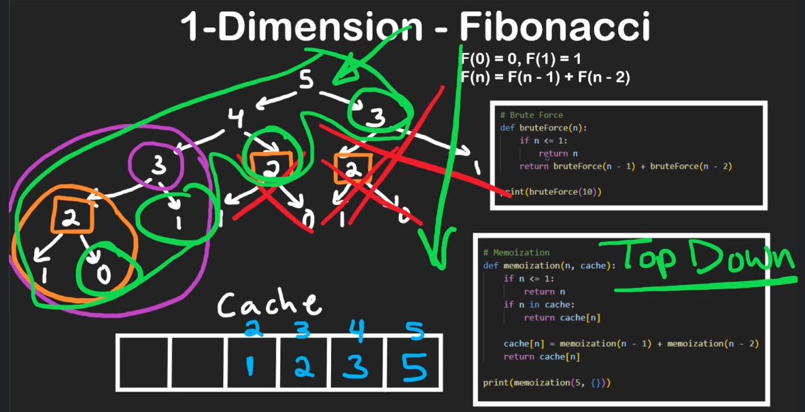
- memoization --- store results in cache that you plan on reusing. (no need to store basecase results) 
  - top-down
  - root of the tree to base case
- tabluation 
  - bottom - up
  - compute result of base case and work upwards
- 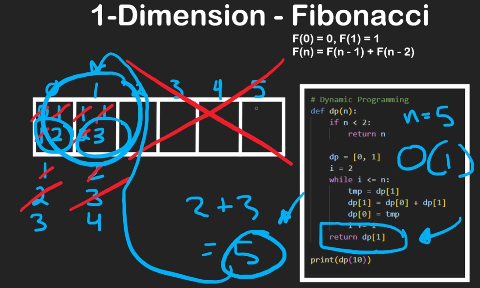
- DP - Big problem -> Break into and solve sub-problems
- Climbing Stairs
  - can be solved in O(log n) using some Matrix Exponentiation / Math equation.
  - 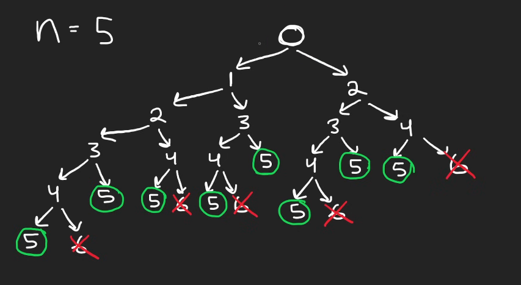
  - 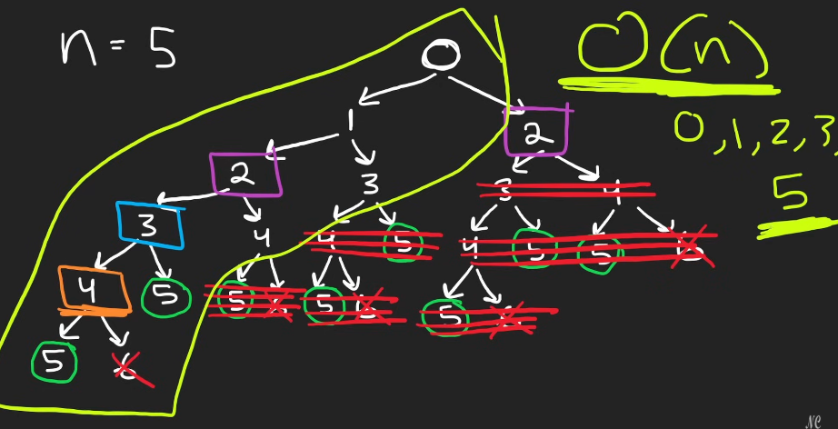
  - 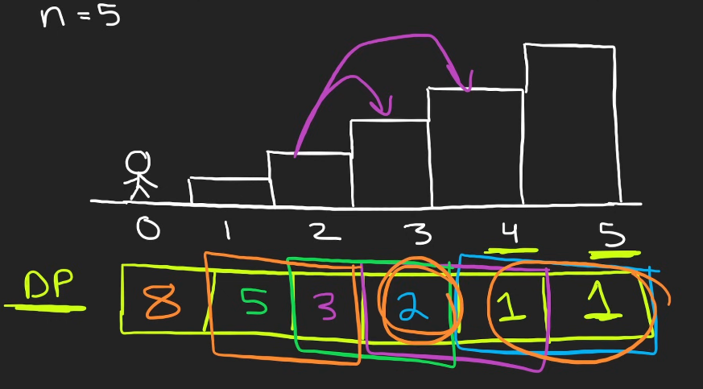

    ```py
    # O(2^n) TC and O(n) SC
    class Solution:
        def climbStairs(self, n:int) -> int:
            def dfs(i):
                if i>=n:
                    return i == n
                return dfs(i+1) + dfs(i+2)
            
            return dfs(0)
    ```

    ```py
    # DP Top Down O(n) TS

    class Solution:
        def climbStairs(self, n:int) -> int:
            cache = [-1] * n
            def dfs(i):
                if i>= n:
                    return i == n
                if cache[i] != -1:
                    return cache[i]
                
                cache[i] = dfs(i+1) + dfs(i+2)
                return cache[i]
            
            return dfs(0)
    ```

    ```py
    # DP Bottom Up O(n) TS

    class Solution:
        def climbStairss(self, n:int) -> int:
            if n <= 2:
                return n
            dp = [0] * (n+1)
            dp[1], dp[2] = 1, 2
            for i in range(3, n+1):
                dp[i] = dp[i-1] + dp[i-2]
            return dp[n]

    class Solution: # O(n) TC O(1) SC
        def climbStairs(self, n:int) -> int:
            one, two = 1, 1

            for i in range(n - 1):
                temp = one
                one = one + two
                two = temp

            return one
    ```

  - House Robber
    - 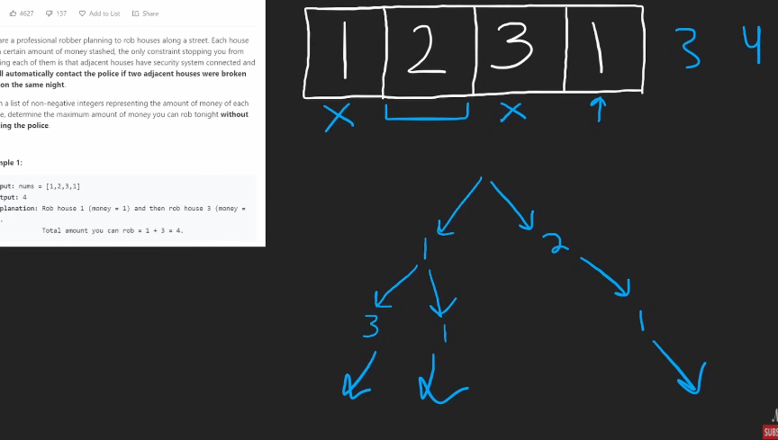
    - `rob = max(arr[0] + rob[2:n], rob[1:n])`

    ```py
    class Solution:
        def rob(self, nums:List[int]) -> int:
            rob1, rob2 = 0, 0 

            # [rob1, rob2, n, n+1, ...]
            for n in nums:
                temp = max(n + rob1, rob2)
                rob1 = rob2
                rob2 = temp
            return rob2

        # O(2^n) T O(n) S
        def rob(self, nums:List[int]) -> int:
            def dfs(i):
                if i>= len(nums):
                    return 0
                return max(dfs(i+1), nums[i]+dfs(i+2))
            return dfs(0)

        # DP top-down O(n) TS
        def rob(self, nums:List[int]) -> int:
            memo = [-1] * len(nums)

            def dfs(i):
                if i>= len(nums):
                    return 0
                if memo[i] != -1:
                    return memo[i]
                
                memo[i] = max(dfs(i+1), nums[i]+dfs(i+2))
                return memo[i]

            return dfs[0]

        # DP bottom-up O(n) TS
        def rob(self, nums):
            if not nums:
                return 0
            if len(nums) == 1:
                return nums[0]
            
            dp = [0] * len(nums)
            dp[0] = nums[0]
            dp[1] = max(nums[0], nums[1])

            for i in range(2, len(nums)):
                dp[i] = max(dp[i-1], nums[i] + dp[i-2])

            return dp[-1]
    ```

#### 2-Dimension DP - Count Paths

- 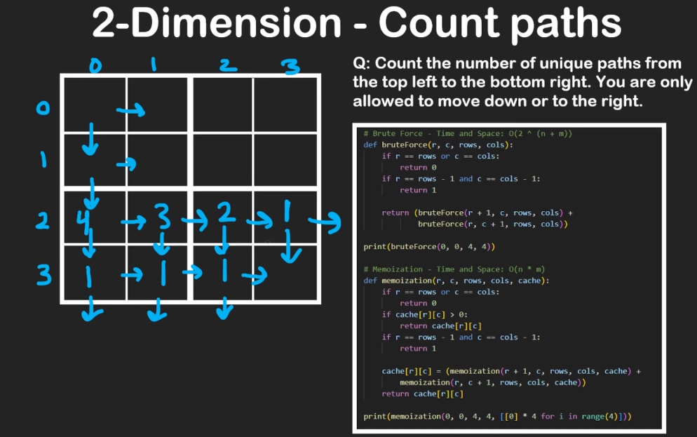
- 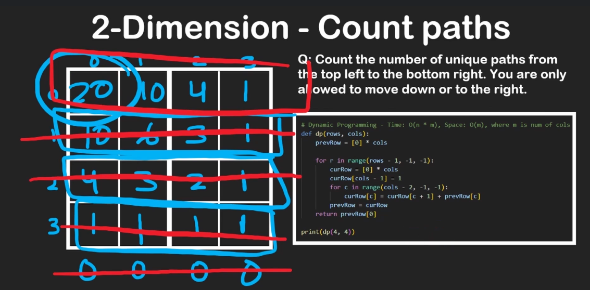

```py
# Bruteforce O(2 ^ (n+m)) TC O(n+m) SC
def bruteForce(r, c, rows, cols):
    if r == rows or c == cols:
        return 0
    if r == rows - 1 and c == cols - 1:
        return 1
    
    return (bruteForce(r+1, c, rows, cols) + bruteForce(r, c+1, rows, cols))

# Memoization - O(n*m) TS
def momization(r, c, rows, cols, cache):
    if r == rows or c == cols:
        return 0
    if r == rows - 1 and c == cols - 1:
        return 1
    
    if cache[r][c] > 0:
        return cache[r][c]
    
    cache[r][c] = (memoization(r+1, c, rows, cols, cache) + memoization(r, c+1, rows, cols, cache))

    return cache[r][c]

# DP - O(n*m) T and O(m) S m is no. of cols
def dp(rows, cols):
    prevRow = [0] * cols

    for r in range(rows - 1, -1, -1):
        currRow = [0] * cols
        currRow[cols - 1] = 1
        for c in range(cols - 2, -1, -1):
            currRow[c] = currRow[c+1] + prevRow[c]

        prevRow = currRow

    return prevRow[0]
```

- Unique Paths II with blockades
    ```py
    class Solution:
        # O(n*m) TS
        def uniquePathsWithObstacles(self, grid:List[List[int]]) -> int:
            m, n = len(grid), len(grid[0])
            dp = {(m-1, n-1): 1}

            def dfs(r, c):
                if r == m or c == n or grid[r][c]:
                    return 0
                if (r, c) in dp:
                    return dp[(r, c)]
                
                dp[(r, c)] = dfs(r+1, c) + dfs(r, c+1)
                return dp[(r, c)]
            
            return dfs(0, 0)

        # DP Space optimized - O(n*m) T O(n) S
        def uniquePathsWithObstacles(self, grid:List[List[int]]) -> int:
            m, n = len(grid), len(grid[0])
            dp = [0] * (n + 1)
            dp[n-1] = 1

            for r in range(m-1, -1, -1):
                for c in range(n-1, -1, -1):
                    if grid[r][c]:
                        dp[c] = 0
                    elif c+1 < n: # else dp[c] += dp[c+1] also works
                        dp[c] = dp[c] + dp[c+1]
                    else:
                        dp[c] = dp[c] + 0

            return dp[0]

        # Bottom-Up O(n*m) TS
        def uniquePathsWithObstacles(self, grid:List[List[int]]) -> int:
            m, n = len(grid), len(grid[0])
            if grid[0][0] == 1 or grid[m-1][n-1] == 1:
                return 0
            dp = [[0] * (n+1) for _ in range(m+1)]

            dp[m-1][n-1] = 1

            for r in range(m-1, -1, -1):
                for c in range(n-1, -1, -1):
                    if grid[r][c] == 1:
                        dp[r][c] = 0
                    else:
                        dp[r][c] += dp[r+1][c]
                        dp[r][c] += dp[r][c+1]

            return dp[0][0]

        # DP In-place O(m*n) T and O(1) S
        def uniquePathsWithObstacles(self, grid:List[List[int]]) -> int:
            m, n = len(grid), len(grid[0])
            if grid[0][0] == 1 or grid[m-1][n-1] == 1:
                return 0

            grid[m-1][n-1] = 1

            for r in range(m-1, -1, -1):
                for c in range(n-1, -1, -1):
                    if r == m-1 and c == n-1:
                        continue:
                    
                    if grid[r][c] == 1:
                        grid[r][c] = 0
                    else:
                        down = grid[r+1][c] if r+1 < m else 0
                        right = grid[r][c+1] if c+1 < n else 0
                        grid[r][c] = down + right
            
            return grid[0][0]
    ```

- Longest Common Subsequence
  - 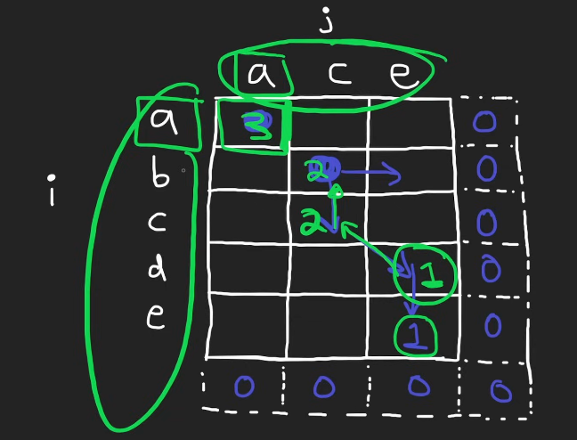

    ```py
    class Solution:

        # Recursion O(2^(n+m)) T O(n+m) S
        def longestCommonSubsequence(self, text1:str, text2:str) -> int:

            def dfs(i, j):
                if i == len(text1) or j == len(text2):
                    return 0
                if text1[i] == text2[j]:
                    return 1 + dfs(i+1, j+1)
                
                return max(dfs(i+1, j), dfs(i, j+1))
            
            return dfs(0, 0)

        # DP Top Down - O(m*n) TS
        def longestCommonSubsequence(self, text1:str, text2:str) -> int:
            memo = {}

            def dfs(i, j):
                if i == len(text1) or j == len(text2):
                    return 0
                if (i, j) in memo:
                    return memo[(i, j)]
                
                if text1[i] == text2[j]:
                    memo[(i, j)] = 1 + dfs(i+1, j+1)
                else:
                    memo[(i, j)] = max(dfs(i+1, j), dfs(i, j+1))
                
                return memo[(i, j)]

            return dfs(0, 0)

        # DP Bottom Up - O(m*n) TS
        def longestCommonSubsequence(self, text1:str, text2:str) -> int:
            dp = [[0 for j in range(len(text2)+1)]
                    for i in range(len(text1) + 1)]
            
            for i in range(len(text1) - 1, -1, -1):
                for j in range(len(text2) -1, -1, -1):
                    if text1[i] == text2[j]:
                        dp[i][j] = 1 + dp[i+1][j+1]
                    else:
                        dp[i][j] = max(dp[i][j+1], dp[i+1][j])

            return dp[0][0]

        # DP Space optimized - O(m*n) T and O(min(m, n)) S
        def longestCommonSubsequence(self, text1:str, text2:str) -> int:
            if len(text1) < len(text2):
                text1, text2 = text2, text1
            
            prev = [0] * (len(text2) + 1)
            curr = [0] * (len(text2) + 1)

            for i in range(len(text1) - 1, -1, -1):
                for j in rnage(len(text2) - 1, -1, -1):
                    if text1[i] == text2[j]:
                        curr[j] = 1 + prev[j+1]
                    else:
                        curr[j] = max(curr[j+1], prev[j])
                prev, curr = curr, prev
            
            return prev[0]

        # DP Optimal - O(m*n) T and O(min(m, n)) S
        def longestCommonSubsequence(self, text1:str, text2:str) -> int:
            if len(text1) < len(text2):
                text1, text2 = text2, text1
            
            dp = [0] * (len(text2) + 1)

            for i in range(len(text1) - 1, -1, -1):
                prev = 0
                for j in range(len(text2) -1, -1, -1):
                    temp = dp[j]
                    if text1[i] == text2[j]:
                        dp[j] = 1 + prev
                    else:
                        dp[j] = max(dp[j], dp[j+1])
                    prev = temp
            
            return dp[0]
    ```

### Bit Manipulation


## Neetcode: Advanced Algorithms (25h)


### Arrays

### Linked Lists

### Trees

### Heaps

### Backtracking

### Graphs

### Dynamic Programming


## Oreilly: Graph Data Structure

### Introduction

- graph -- non linear data structure 
  - nodes or vertices
  - edges or connections between pairs of vertices
  - unweighted graph
  - weighted graph
  - undirected graph
  - directed graph
  - cyclic graph 
  - acyclic graph
  - tree - special case of directed acyclic graphs
- networks, relationships
- only data structure that has cycle -- graph
- graph types 
  - directed
    - weighted
      - positive 
      - negative
    - unweigted
  - undirected
    - weighted 
      - positive
      - negative
    - unweighted


<br/><br/>

### Graph Representation 

- graph representation 
  - adjacency matrix -- 2d array
    - 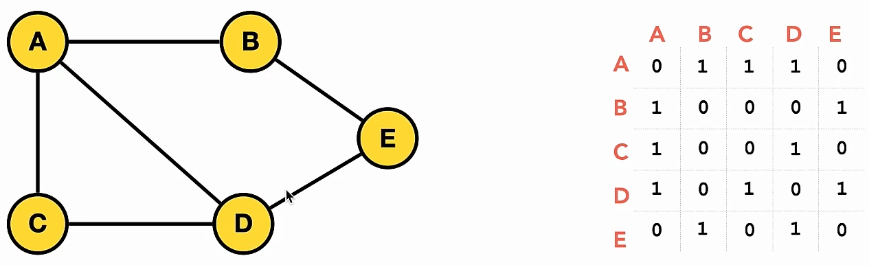
    - use when graph is complete, or almost complete 
  - adjacency list -- collection of unordered list 
    - 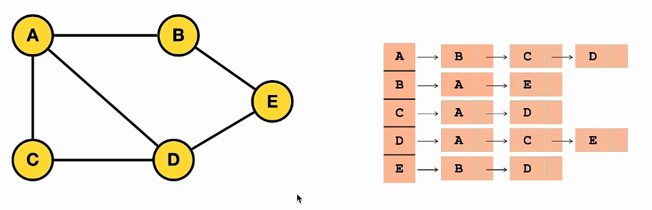
    - use when edges are few

```py
# Adjacency List

from collections import deque 

class Graph: # O(e + v) SC
    def __init__(self):
        self.adjacency_list = {}

    def add_vertex(self, vertex): # O(1) TC 
        if vertex not in self.adjacency_list.keys(): # dictionaries in python are implemented as hashtables
            self.adjacency_list[vertex] = []
            return True
        return False

    def add_edge(self, vertex1, vertex2):
        if vertex1 in self.adjacency_list.keys() and vertex2 in self.adjacency_list.keys():
            self.adjacency_list[vertex1].append(vertex2)
            self.adjacency_list[vertex2].append(vertex1)
            return True
        return False

    def remove_edge(self, vertex1, vertex2):
        if vertex1 in self.adjacency_list.keys() and vertex2 in self.adjacency_list.keys():
            try:
                self.adjacency_list[vertex1].remove(vertex2)
                self.adjacency_list[vertex2].remove(vertex1)
            except ValueError:
                pass
            return True
        return False

    def remove_vertex(self, vertex):
        if vertex in self.adjacency_list.keys():
            if other_vertex in self.adjacency_list[vertex]:
                self.adjacency_list[other_vertex].remove(vertex)
            del self.adjacency_list[vertex]
            return True
        return False

    def bfs(self, vertex): # O(V+E) TC and O(V) SC -- visited set
        visited = set()
        visited.add(vertex)

        # queue = [vertex]
        queue = deque([vertex])

        while queue:
            current_vertex = queue.pop(0) # use deque from collections to get O(1) instead of O(n)
            current_vertex = queue.popleft()
            print(current_vertex)
            for adjacent_vertex in self.adjacency_list[current_vertex]:
                if adjacent_vertex not in visited:
                    visited.add(adjacent_vertex)
                    queue.append(adjacent_vertex)

    def dfs(self, vertex): # O(V+E) TC O(V) SC
        visited = set() # O(1)
        stack = [vertex]
        while stack: # O(v)
            current_vertex = stack.pop()
            if current_vertex not in visited:
                print(current_vertex)
                visited.add(current_vertex)

                for adjacent_vertex in self.adjacency_list[current_vertex]: # O(e)
                    if adjacent_vertex not in visited:
                        stack.append(adjacent_vertex)
                


new_graph = Graph()
new_graph.add_vertex('V')
new_graph.add_vertex('I')
new_graph.add_vertex('N')
new_graph.add_vertex('N')
new_graph.add_vertex('U')
new_graph.add_edge('V', 'U')
new_graph.add_edge('V', 'N')
new_graph.remove_edge('V', 'N')
new_graph.remove_vertex('I')
print(new_graph.adjacency_list)
```


```py
# Adjacency Matrix
class Graph:
    def __init__(self, num_vertices):
        self.num_vertices = num_vertices
        self.adjacency_matrix = [[0 for _ in range(num_vertices)] for _ in range(num_vertices)]

    def add_edge(self, vertex1_index, vertex2_index):
        if vertex1_index >= self.num_vertices or vertex2_index >= self.num_vertices:
            return False
        self.adjacency_matrix[vertex1_index][vertex2_index] = 1
        self.adjacency_matrix[vertex2_index][vertex1_index] = 1
        return True

    def remove_edge(self, vertex1_index, vertex2_index):
        if vertex1_index >= self.num_vertices or vertex2_index >= self.num_vertices:
            return False
        self.adjacency_matrix[vertex1_index][vertex2_index] = 0
        self.adjacency_matrix[vertex2_index][vertex1_index] = 0
        return True
     

new_graph = Graph(5)
new_graph.add_edge(0, 1)
new_graph.remove_edge(0, 1)
print(new_graph.adjacency_matrix)
```


<br/><br/>

### Graph Traversal 

- Breadth First Search - BFS
- start at arbitrary node, and explore the neighbor nodes first before moving to next level 
```py
def bfs(self, vertex):
    visited = set()
    visited.add(vertex)

    queue = [vertex]
    while queue:
        current_vertex = queue.pop(0)
        print(current_vertex)
        for adjacent_vertex in self.adjacency_list[current_vertex]:
            if adjacent_vertex not in visited: 
                visited.add(adjacent_vertex)
                queue.append( adjacent_vertex)
```


<br/><br/>

- Depth First Search - DFS
- start at arbitrary ndoe, go as deep as you can, and then backtrack
```py
def dfs(self, vertex):
    visited = set()
    stack = [vertex]

    while stack:
        current_vertex = stack.pop()
        if current_vertex not in visited:
            print(current_vertex)
            visited.add(current_vertex)
        for adjacency_vertex in self.adjacency_list[current_vertex]:
            if adjacent_vertex not in visited: 
                stack.append(adjacent_vertex)
        
```

- 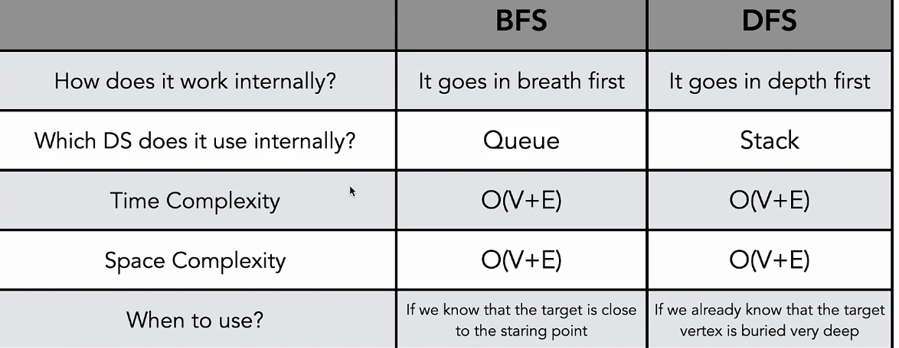


### Graph Algorithms 

- Topological Sort


## ZTM: Master Coding Interviews


### [Arrays: Two Sum (Easy)](https://leetcode.com/problems/two-sum/)

- Q
  - given integers, return indices of two numbers that add to a given integer
- Steps
  - verify constraints
    - positive vs negative numbers
    - duplicate numbers vs unique
    - solution is always available?
    - what to return if no solution?
    - can there be multiple solutions?
  - write test cases
  - figure out solution without code (don't worry about optimization; just working sol)
    - two pointer technique 
      - every possible combination 
      - number to find = target - pointer 1 
    - in this step, you figure out how to approach the problem  | logic
  - write out solution in code
  - double check for errors
    - spellings
    - typos
    - variable names
    - cases
    - closing loops, functions
  - test the sol against test cases (walk through)
  - analyze time and space resources 
  - can we optimize our solution?
    - can we make use of more space to reduce time?
    - can you merge the two loops?

```js
// Bruteforce O(N^2) TC; O(1) SC

const findTwoSum = function(nums, target){
    for(let p1=0; p1 < nums.lenght; p1++){
        const number_to_find = target - nums[p1];
        for (let p2 = p1 + 1; p2< nums.length; p2++){
            if (number_to_find === nums[p2]){
                return [p1, p2];
            }
        }
    }

    return null;
}
```

```js
// Hashmap O(N) TC; O(N) SC;
const findTwoSum = function(nums, target){
    const numsMap = {};
    for (let p = 0; p<nums.length; p++){
        const currMapVal = numsMap[nums[p]];

        if (currMapVal >= 0){
            return [currMapVal, p];
        } else {
            const number_to_find = target - nums[p];
            numsMap[number_to_find] = p;
        }
    }

    return null;
}
```


### [Arrays: Container With Most Water (Medium)](https://leetcode.com/problems/container-with-most-water/)

- Q
  - given an array of positive integers
  - each integer represents height of vertical line
  - find two lines which together with x-axis form a container that holds greatest amount of water
    - so we need to find all containers (sols); we don't stop after finding first container. 
  - return area of water it would hold
- Steps
  - verify constraints
    - does thickness of lines affect the area?
    - do left and right sides of graph count as walls?
    - does a higher line inside our container affect our area? (say between 7 and 6, you have a 8)
  - write test cases
    - when length <= 1 return 0
  - figure out sol without code (logic)
    - area = length (min of a, b) x width (right index - left index)
    - use this with every combination of a, b
  - write out sol with code
  - double check for errors
  - test sol against test cases
  - analyze time and space
  - can we optimize?
    - if we increase space, does the time get reduced in this case?
    - shifting pointers? 
    - area = min(a, b) x (bi - ai)
      - only min(a, b) has direct effect on outcome, max area
      - also, width has a direct effect

```js
// Bruteforce O(n^2) TC; O(1) SC;

const getMaxAreaWaterContainer = function(heights){
    let maxArea = 0;
    for(let p1 = 0; p1 < heights.length; p1++){
        for(let p2=0; p2 < heights.length; p2++){
            const height = Math.min(heights[p1], heights[p2]);
            const width = p2 - p1;
            const area = height * width;
            maxArea = Math.max(maxArea, area);
        }
    }

    return maxArea;
}
```

```js
// Two Shifting Pointers O(n) TC; O(1) SC;

const getMaxAreaWaterContainer = function(heights){
    let p1=0, p2 = heights.length -1, maxArea = 0;

    while(p1 < p2){
        const height = Math.min(heights[p1], heights[p2]);
        const width = p2 - p1;
        const area = height * width;
        maxArea = Math.max(maxArea, area);

        if (heights[p1] <= heights[p2]){
            p1++;
        } else {
            p2 --;
        }
    }

    return maxArea;
}
```

### [Arrays: Trapping Rainwater (Hard)](https://leetcode.com/problems/trapping-rain-water/)

- Q
  - given array of integers representing elevation map 
  - width of each bar is 1
  - return how much rainwater can be trapped
- Steps
  - verify constraints
    - do left and right sides of graph count as walls?
    - will there be negative integers?
  - write test cases
    - arr length <= 1 return 0
    - increasing/decreasing values -- sorted -- 0
  - figure out solution without code (logic)
    - current_water = min(max_left, max_right) - current_height 
    - total = maxL, maxR = 0    

```js
// Bruteforce O(N^2) TC; O(1) SC;

const getTrappedRainWater = function(heights){
    let total_water = 0;

    for(let p = 0; p < heights.length; p++){
        let left_p = p, right_p = 0, max_left = 0, max_right = 0;
        while(left_p >= 0){
            max_left = Math.max(max_left, heights[left_p]);
            left_p--;
        }

        while(right_p < heights.length){
            max_right = Math.max(max_right, heights[right_p]);
            right_p++;
        }

        const curr_water = Math.min(max_left, max_right) - heights[p];

        if(curr_water >= 0) {
            total_water += curr_water;
        }
    }

    return total_water;
}
```

```js
// Inward shifting two pointers O(n) TC; O(1) SC;

// 1. identify pointer with lesser value
// 2. is this pointer value >= max on that side
        // yes -> update max on that side
        // no -> get water for pointer value, add to total
// 3. move pointer inwards
// 4. repeat for other pointer

const getTrappedRainWater = function(heights){
    let total_water = 0, left = 0, right = heights.length - 1, left_max = 0, right_max = 0;
    let curr_p = 0;

    while(left < right){
        if (heights[left] <= heights[right]) {
            if(heights[left] >= left_max){
                left_max = heights[left];
            } else {
                total_water += left_max - heights[left];
            }

            left ++;
        } else {
            if(heights[right] >= right_max){
                right_max = heights[right];
            } else {
                total_water += right_max - heights[right];
            }

            right--;
        }
    }

    return total_water;
}
```

### [Strings: Typed Out Strings (Easy) **](https://leetcode.com/problems/backspace-string-compare/)

- Q
  - given two strings S and T
  - return if they equal when both are typed out
  - any # that appears in string counts as a backspace
- Steps
  - verify constraints
    - what happens when two hashes appear beside each other?
    - what happens to hash when there is no character to remove?
    - are two empty strings equal to each other?
    - does case sensitivity matter?
  - write test cases
  - figure out solution without code -- logic
  - write out solution with code 
  - double check for errors
  - test against test cases
  - analyze time and space 
  - can we optimize?
    - can we reduce space usage?
    - utilize original strings instead of building new one
    - use two pointer technique 
      - deciding when to move pointers (independently, or both at same time) after each iteration
      - start from end of strings 

```js
// Bruteforce O(a + b) TC; O(a + b) SC;


// O(N) TC
const buildString = function(string){
    const builtArray = [];

    for (let p = 0; p < string.length; p++){
        if (string[p] !== '#'){
            builtArray.push(string[p]);
        } else {
            builtArray.pop();
        }
    }

    return builtArray;
}


const backSpaceCompare = function(S, T){
    const finalS = buildString(S); // O(a)
    const finalT = buuldString(T); // O(b)

    if(finalS.length !== finalT.Length) { return false; }

    for(let p = 0; p < finalS.length; p++){
        if(finalS[p] !== finalT[p]){
            return false;
        }
    }

    return true;
}
```

```js
// Two Pointers O(a + b) TC; O(1) SC;

// backspacing is tricky

const backspaceCompare = function (S, T) {
    let p1 = S.length - 1, p2 = T.length - 1;

    while (p1 >= 0 || p2 >= 0) {
        // Handle backspaces in S
        if (S[p1] === "#") {
            let backCount = 2;
            while (backCount > 0 && p1 >= 0) {
                p1--;
                backCount--;
                if (S[p1] === "#") {
                    backCount += 2;
                }
            }
        }

        // Handle backspaces in T
        if (T[p2] === "#") {
            let backCount = 2;
            while (backCount > 0 && p2 >= 0) {
                p2--;
                backCount--;
                if (T[p2] === "#") {
                    backCount += 2;
                }
            }
        }

        // Compare characters
        if (p1 >= 0 && p2 >= 0 && S[p1] !== T[p2]) {
            return false;
        }

        // If one pointer is out of bounds but the other is not
        if ((p1 >= 0) !== (p2 >= 0)) {
            return false;
        }

        // Move to the next character
        p1--;
        p2--;
    }

    return true;
};

// Test Cases
const string1 = "ab#z";
const string2 = "az#z";
console.log(backspaceCompare(string1, string2)); // Output: true
```

```js
const nextValidCharIndex = function(s, index){
    backCount = 0;
    while(index >= 0){
        if(s[index] === '#'){
            backCount++;
        } else if (backCount > 0){
            backCount--;
        } else {
            return index;
        }

        index--;
    }

    return -1;
}

const backSpaceCompare = function(s, t){
    let p1 = s.length - 1, p2 = t.length - 1

    while(p1 >= 0 || p2 >= 0){
        p1 = nextValidCharIndex(s, p1);
        p2 = nextValidCharIndex(t, p2);

        if(p1>=0 && p2 >=0) {
            if (s[p1] !== t[p2]){
                return false;
            }
        }

        if ((p1>=0) !== (p2>=0)) return false;

        p1--;
        p2--;
    }

    return true;
}
```

```python
class Solution:

    def getValidCharIndex(s: str, index: int) -> int:
        backSpace = 0
        while index >=0:
            if s[index] == '#':
                backSpace += 1
            elif backSpace > 0:
                backSpace -= 1
            else:
                return index
            index -= 1
        return -1 

    def backspaceCompare(self, s: str, t: str) -> bool:
        p1, p2 = len(s) - 1, len(t) - 1

        while p1>=0 or p2 >= 0:
            p1 = Solution.getValidCharIndex(s, p1)
            p2 = Solution.getValidCharIndex(t, p2)

            if p1>=0 and p2>=0 and s[p1]!=t[p2]:
                return False

            if (p1>=0) != (p2>=0):
                return False

            p1 -= 1
            p2 -= 1
        
        return True
```

### Strings: Longest Substring Without Repeating Characters (Medium)

- Q
  - given a string, find length of longest substring without repeating characters.
- Steps
  - verify constraints 
    - is substring contiguous?
      - substring (contiguous) vs subsequence (not contiguous)
    - does case sensitivity matter
  - write test cases
    - best case test case
    - empty | null case
    - overlaps
  - figure out sol without code (logic)
  - can we optimize?
    - hint1: use sliding window to represent the current substring
    - hint2: size of window will change based on new chars, and chars we've already seen 
    - hint3: seen chars hashmap keeps track of what we've seen, and the index we saw them at
    - 

```js
// Bruteforce O(N^2) TC; O(N) SC;

const lengthOfLongestSubstring = function(string){
    if(string.length <= 1) return string.length;

    let longest = 0; 

    for(let left=0; left < string.length; left++){
        let seenChars = {}, currLength = 0;
        for(let right = left; right < string.length; right++){
            const currChar = string[right];
            if (!seenChars[currChar]){
                currLength++;
                seenChars[currChar] = true;

                longest = Math.max(longest, currLength);
            } else {
                break;
            }
        }
    }

    return longest;
}
```

- sliding window is similar to two pointers
- form a window over some portion of sequential data, then move that window throught the data to capture different parts of it
- sequential data -- order is important (arrays, strings, linkedlists)
- Q
  - given array of ints, find two contiguous integers that form greatest sum

```js
// Sliding Window O(N) TC; O(N) SC;

const lengthOfLongestSubstring = function(s){
    if(s.length <= 1) return s.length;

    let longest = 0, left = 0, seenChars = {};

    for(let right = 0; right < s.length; right++){
        const currChar = s[right];
        const prevSeenChar = seenChars[currChar];
        if (prevSeenChar >= left){
            left = prevSeenChar + 1;
        }

        seenChars[currChar] = right;
        longest = Math.max(longest, right - left + 1);
    }

    return longest;
}
```

```js
// Sliding Window O(N) TC; O(N) SC;

const lengthOfLongestSubstring = function(s){
    if(s.length <= 1) return s.length;

    let longest = 0, left = 0, seenChars = new Map();

    for(let right = 0; right < s.length; right++){
        const currChar = s[right];
        const prevSeenChar = seenChars.get(currChar);
        if (prevSeenChar >= left){
            left = prevSeenChar + 1;
        }

        seenChars.set(currChar, right);
        longest = Math.max(longest, right - left + 1);
    }

    return longest;
}
```

### Strings: Valid Palindrome and Almost Palindrome

- Q
  - A subproblem is a probllem we have to solve along the way to solve the main problem 
    - main: find length of longest unique substring
    - sub: pattern matching - unique string
  - A palindrome is a stirng that reads the same forwards and backwards
    - can check chars from ends to middle
    - can check chars from middle to end
    - can reverse string and compare with original from start
  - Given a string, determine if it is a palindrome, considering only alphanumeric chars and ignoring case sensitivity
- Steps
  - verify constraints
  - write test cases
    - odd, even strings
    - fail case
    - empty string
    - single char
    - punctuation, case sensitivity
  - figure out solution without code (logic)

```js
const isValidPalindrome = function(s){
    s = s.replace(/[^A-Za-z0-9]/g, '').toLowerCase();

    
}
```

- Q 
  - given a string, determine if it is almost a palindrome
  - ie., if it becomes a palindrome by removing one letter
  - consider only alphanumeric chars and ignore case
- Steps
  - verify constraints
    - do we consider a palindrome as almost a palindrome?
  - write test cases
    - `race a car` `True`
    - `abccdba` `True`
    - `abcdefdba` `False`
    - ` ` `True`
    - `a` `True`
    - `ab` `True`


```js
// O(N) TC; O(1) SC;

const validSubPalindrome = function(s, left, right){
    while(left < right){
        if(s[left] !== s[right]){
            return false;
        }

        left++;
        right--;
    }

    return true;
}

const isAlmostPalindrome = function(s){
    s = s.replace(/[^A-Za-z0-9]/g, '').toLowerCase();

    let left = 0, right = s.length - 1;
    while(left < right){
        if(s[left] !== s[right]){
            return validSubPalindrome(s, left+1, right) || validSubPalindrome(s, left, right - 1);
        }

        left++;
        right--;
    }
    
    return true;
}
```


### Intro Linked Lists - Basics, Reverse A LL

- singly linked list is a chain of a data structure called list node (class, struct, ...) with val and next properties
- head, tail 
- cycle (tail doesn't point to null but points to one of the nodes)

- Q
  - given a linked list, return it in reverse
- Steps
  - verify constraints
    - what to return when we get null or single node?
  - write test cases
    - 1-2-3-4-5 = 5-4-3-2-1
    - 3 = 3
    - null = null
  - figure out sol without code (logic)

```js
// O(N) TC; O(1) SC;

const reverseLinkedList = function(head){
    let prev = null;
    let current = head;

    while(current){
        let next = current.next;

        current.next = prev;
        prev = current;
        current = next;
    }

    return prev;
}
```


### Linked Lists: M, N Reversals (Medium)

- Q
  - given a linked list and numbers m and n, return it back with only positions m to n in reverse. 
- Steps
  - verify constraints
    - is positioning 0-indexed or 1-indexed
    - will m and n be always within bounds of linked list 1<=m<=n<=lengthofll
    - can we receive m and n values for the whole linked list
  - write test cases
    - best case
  - figure out sol without code (logic)

```js
// O(N) TC; O(1) SC;

// 1. get current node
// 2. store next value
// 3. update next value to list so far
// 4. store current node as list so far
// 5. update current node to store next value at 2

const reverseBetween = function(head, m, n){
    let currentPos = 1, currentNode = head, start = head;

    while(currentPos < m){
        start = currentNode;
        currentNode = currentNode.next;
        currentPos++;
    }

    let newList = null, tail = currentNode;

    while(currentPos >= m && currentPos <= n){
        const next = currentNode.next;
        currentNode.next = newList;
        newList = currentNode;
        currentNode = next;
        currentPos++;
    }

    start.next = newList;
    tail.next = currentNode;

    if(m > 1) {return head;} else { return newList;}


    while (currentNode){

    }
}
```

### Linked List: Merge Multi-Level Doubly Linked List (Medium)

- Q
  - Given a doubl linked list
  - list nodes also have a child property that can point to a separate doubly linked list
  - these child lists can also have one or more child doubly linked lists of their own, and so on
  - return the list as a single level flattened doubly linked list
- Steps
  - verify constraints
    - can a DLL have multiple child list nodes? 
    - what do we do with child properties after flattening? 
  - write test cases
    - best case test case (total problem space)
      - order in which list nodes appear matters 
      - multiple levels might influence this outcome 

```js
// O(N) TC; O(1) SC;

const flatten = function(head){
    if(!head) return head;

    let currNode = head; 

    while(currNode !== null){
        if(currNode.child === null){
            currNode = currNode.next;
        } else {
            let tail = currNode.child; 

            while(tail.next !== null){
                tail = tail.next;
            }

            tail.next = currNode.next;
            if(tail.next !== null) tail.next.prev = tail;

            currNode.next = currNode.child; 
            currNode.next.prev = currNode; 
            currNode.child = null;
        }
    }
}
```

### Linked List: Cycle Detection (Medium) **

- Q
- Steps

```js
// O(N) TC; O(N) SC;
const findCycle = function(head){
    let currNode = head;

    const seenNodes = new Set();

    while(!seenNodes.has(currNode)){
        if(currNode.next === null) { return false;}

        seenNodes.add(currNode);
        currNode = currNode.next;
    }

    return currNode;
}
```

```js
// Floyd's Tortoise and Hare Algorithm
// O(N) TC; O(1) SC;

const findCycle = function(head){
    let tortoise = head, hare = head; 
    while(true){
        hare = hare.next;
        tortoise = tortoise.next;

        if(hare === null || hare.next === null) { return false;} else { hare = hare.next;}

        if(tortoise === hare) break;
    }

    let p1 = head, p2 = tortoise; 
    while(p1 !== p2){
        p1 = p1.next; 
        p2 = p2.next;
    }

    return p1; 
}
```

```py
# O(N) TC; O(N) SC;

def hasCycle(head):
    nodes_seen = set()

    curr = head
    while curr is not None:
        if curr in nodes_seen:
            return True
        nodes_seen.add(curr)
        curr = curr.next
    return False
```

```py
# O(N) TC; O(1) SC;

def hasCycle(head):
    if head is None: 
        return False

    slow = head
    fast = head.next

    while slow!=fast:
        if fast is None or fast.next is None: 
            return False
        slow = slow.next
        fast = fast.next.next
    return True


def hasCycle(head):
    slow, fast = head, head
    while fast and fast.next:
        slow = slow.next
        fast = fast.next.next

        if slow == fast:
            # return True
            break
    else: # only executes when the above loop is run without any interruption
        return False

    slow = head
    while slow != fast:
        slow = slow.next
        fast = fast.next

    return slow # returns the node at which cycle begun
```


### [Stacks: Valid Parentheses (Easy)](https://leetcode.com/problems/valid-parentheses/)

- Stacks and Queues are assisting data structures that you might use to solve a sub problem. Order of storage and retrieval. 
- Stack 
  - Last In First Out
  - Latest piece of data
- Q
  - Given a string containing only parenthesis, determine if it is valid.
- Steps
  - VC - Verify Constraints
    - does empty string count as valid?
  - WTC - Write Test Cases
  - FOS - Figure out Solution / Logic
  - WC - Write Code
  - TSAT - Test Sol Against Test Cases
  - ATAS - Analyze Time and Space
  - CWO - Can We Optimize? 

```js
// O(N) TC; O(N) SC;

const isValidParenthesis = function(s){
    const parens = {
        '(':')', 
        '{':'}', 
        '[':']'
    }

    if(s.length === 0) return true;

    const stack = [];

    for(let i = 0; i < s.length; i++){
        if(parens[s[i]]){
            stack.push(s[i]);
        } else {
            const leftBracket = stack.pop();
            const corrBracket = parens[leftBracket];
            if(s[i] !== corrBracket) return false;
        }
    }

    return stack.length === 0
}
```

```py
class Solution:
    def isValid(self, s: str) -> bool:
        stack = []
        mapping = {')':'(', '}':'{', ']':'['}

        for char in s:
            if char in mapping:
                top_element = stack.pop() if stack else '#'
                if mapping[char] != top_element:
                    return False
            else:
                stack.append(char)
        return not stack
```

### Stacks: Minimum Brackets To Remove (Medium)

- Q
  - Given a string containing only round brackets, and lowercase characters, remove least amount of brackets so string is valid 
  - a string is valid if it is empty or if there are brackets, and they all close. 
- Steps
    - VC
      - what do we return? 
      - will there be spaces in string?
      - is a string containing only lowercase characters valid?
    - WTC
      - basics
      - edge cases

- Stack is all about order of storage and retrieval of data -- order of processing data
  - when do i store 
  - when do i retrieve
- Two pointers is optimization

```js
// O(4N) TC; O(2N) SC;
const minRemoveToMakeValid = function(s){
    const stack = [];
    
    for(let i=0; i<res.length; i++){
        const res = str.split('');
        if(res[i] === '('){
            stack.push(i);
        } else if (res[i] === ')' && stack.length) {
            stack.pop();
        } else if (res[i] === ')') {
            res[i] = '';
        }
    }

    while(stack.length)  {
        const currIndex = stack.pop();
        res[currIndex] = '';
    }

    return res.join('')
}
```


### Queues: Implement Queue with Stacks (Easy)

- Q
  - implement queue using stacks 
  - enqueue, dequeue, peek, empty
- Steps
  - VC 
    - do queue methods we need to implement need to perform at same complexity as real queue - O(1)

```js
class QueueWithStacks {
    Constructor(){
        this.in = [];
        this.out = [];
    }

    enqueue(val){
        this.in.push(val);
    }

    // O(N)
    dequeue(){
        if(this.out.length === 0){
            while(this.in.length){
                this.out.push(this.in.pop());
            }
        }

        return this.out.pop();
    }

    // O(N)
    peek(){
        if(this.out.length === 0){
            while(this.in.length){
                this.out.push(this.in.pop());
            }
        }

        return this.out.[this.out.length - 1];
    }

    empty(){
        return this.in.length === 0 && this.out.length === 0;
    }
}
```

### Recursion: Kth Largest Element (Sorting and Hoare's QuickSelect)

- Tail Recursion
  - recursion - O(N) space
  - tail recursion - O(1) space

```js
function tailFactorial(x, totalSoFar = 1){
    if (x === 0){
        return totalSoFar;
    } else {
        return tailFactorial(x - 1, totalSoFar * x);
    }
}

function recFactorial(x){
    if( x <= 1){
        return 1;
    } else {
        return x * recFactorial(x-1);
    }
}
```

- Sorting 
- Predictable patterns

- Q 
  - given unsorted array, return kth largest element in sorted order, not the kth distinct element
- Steps
  - VC
    - can we get a k larger than length of array?
  - WTC
    - unique values
    - duplicate values
    - one element
  - FOSL

- Quick sorts inplace, recursive
  - say i and j point to index 0 
  - pivot points to index -1 
  - while j is < pivot, swap i and j, and advance. 
  - at the end, swap i and pivot
- Divide and Conquer
  - multi-branched recursion
  - breaks a problem into multiple smaller but same sub-problems
  - combines solutions of these into solution for original problem

```js
// O(NLOGN) TC; O(LOGN) SC;
const quickSort = function(array, left, right){
    if (left < right){
        const partitionIndex = partition(array, left, right);
        quickSort(array, left, partitionIndex - 1);
        quickSort(array, partitionIndex + 1, right);
    }
}

const partition = function(array, left, right){
    const pivotElement = array[right];
    let partitionIndex = left; 

    for(let j = left; j < right; j++){
        if(array[j] < pivotElement){
            swap(array, paritionIndex, j);
            partitionIndex++;
        }
    }

    swap(array, partitionIndex, right);

    return partitionIndex;
}

const swap = function(array, i, j){
    const temp = array[i];
    array[i] = array[j];
    array[j] = temp;
}


const getKthLargest(array, left, right){
    const indexToFind = array.length - k; 
    quickSort(array, 0, array.length - 1);
    return array[indexToFind];
}
```


```js
// O(N) Best Case TC
// O(N^2) Worst Case TC

const quickSelect = function(array, left, right, indexToFind){
    if(left < right){
        const partitionIndex = partition(array, left, right);
        if(partitionIndex === indexToFind){
            return array[partitionIndex];
        } else if (indexToFind < partitionIndex){
            return quickSelect(array, left, paritionIndex - 1, indexToFind);
        } else {
            return quickSelect(array, paritionIndex + 1, right, indexToFind);
        }
    }
}
```

### Recursion: Start and End of Target (Medium) Binary Search

- Linear Search - O(N)
- Binary Search - O(Log N)
  - mid = (start + end) / 2 -- rounded down
  - log is reverse of an exponent 
  - how many times can I divide N by base b to get value 

```js
// O(Log N) TC; O(1) SC;
const binarySearch = function(array, target){
    let left = 0, right = array.length - 1;
    while(left <= right){
        const mid = Math.floor((left + right) / 2);
        const foundVal = array[mid];

        if(foundVal === target){
            return mid;
        } else if (foundVal < target){
            left = mid + 1; 
        } else {
            right = mid - 1;
        }
    }

    return -1;
}
```

- Q 
  - Given sorted ascending array, return starting and ending index of given target value in array [x, y]
- Steps
  - VC
    - what to return if target not found
  - WTC
    - [1, 3, 4, 4, 5], 4 --- return [2, 3]
    - [], 3 --- return [-1, -1]
- Approaches
  - 1. you can do binary search, once target is found, scan to left and right to find borders/edges 
  - 2. you can do binary search, once target is found, binary search again on left and right until you don't find the element or is end of boundaries

```js
const binarySearch = function(nums, left, right, target){
    while(left <= right){
        const mid = Math.floor((left+right)/ 2);
        const findVal = nums[mid];

        if(findVal === target){
            return mid;
        } else if(findVal < target){
            left = mid + 1;
        } else {
            right = mid - 1;
        }
    }

    return -1;
}

const searchRange = function(nums, target){
    if (nums.length === 0) return [-1, -1];

    const firstPos = binarySearch(nums, 0, nums.length - 1, target);

    if (firstPos === -1) return [-1, -1];

    let startPos = firstPos, endPos = firstPos, temp1, temp2;

    while(startPos !== -1){
        temp1 = startpos;
        startPos = binarySearch(nums, 0, startPos - 1, target);
    }

    startPos = temp1;

    while(endPos !== -1){
        temp2 = endPos;
        endPos = binarySearch(nums, endPos + 1, nums.length - 1, target);
    }

    endPos = temp2;

    return [startPos, endPos];
}
```

### Binary Trees: Maximum Depth of Binary Tree (Easy)

- Breadth First Search
- Depth First Search - recursive
  - Pre-order traversal
  - In-order traversal
  - Post-order traversal

- Q 
  - given binary tree, find max depth
  - max depth = number of nodes along the longest path from root to leaf node
- Steps
  - VC
    - what to return if tree is empty?
  - WTC
    - best case
    - worst case -- only one path, say a linked list O(N)
    - null case

```js
// O(N) TC; O(Height of tree) SC -- LOG N, N(worst case);
const maxDepth = function(node, currentDept){
    if(!node){
        return currentDepth;
    }

    currentDepth++;

    return Math.max(maxDepth(node.left, currentDepth), maxDepth(node.right, currentDepth));
}
```

### Binary Trees: Level Order of Binary Tree (Medium)

- Q 
  - given binary tree, return level order traversal of node values as array
  - values at every level (left to right)
- Steps
  - VC
    - what if tree is empty?
  - WTC
    - each level is an array of it's own. so array of arrays

- BFS
  - top down, left to right
- Approach
  - identify level of tree
  - initialize our array
  - push our array to final result

```js
const bfs = function(root){
    res = [], q = [root];
    while(q.length){
        node = q.shift();
        res.push(node.val);
        if(node.left) q.push(node.left);
        if(node.right) q.push(node.right);
    }
    
    return res;
}

// O(N) TC; O(N) SC;
const levelOrder = function(root){
    if(!root) return [];

    const res = [];
    const queue = [root];

    while(queue.length){
        let length = queue.length, count = 0; 
        const currentLevelValues = [];

        while(count < length){
            const currentNode = queue.shift();
            currentLevelValues.push(currentNode.value);

            if(currentNode.left) queue.push(currentNode.left);
            if(currentNode.right) queue.push(currentNode.right);
            count++;
        }

        res.push(currentLevelValues);
    }

    return res;
}
```

### Binary Trees: Right Side View of Tree (Medium)

- Q
  - Given binary tree, imaging you are standing to right of the tree. 
  - Return an array of values of the ndoes you can see ordered from top to bottom
- Steps
- Approach
  - BFS
    - identify the end of level
    - add last node to result
  - DFS
    - prioritize right side
    - keep track of level of nodes
  - traversals -- always going from left to right
    - pre-order (usually NLR) --> (here) NRL
    - in-order (usually LNR) --> (here) RNL
    - post-order (usually LRN) --> (here) RLN
- Don't pick one and force a solution out of it if you don't see a pattern right away
- Instead, take a step back, and find a pattern. 

```js
// BFS: O(N) TC; O(W fattest level) SC; 
const rightSideView = function(root){
    if(!root) return [];

    const res = [], queue = [root];

    while(queue.length){
        let length = queue.length, count = 0;

        while(count < length){
            const currentNode = queue.shift();
            
            if(currentNode.left) queue.push(currentNode.left);
            if(currentNode.right) queue.push(currentNode.right);
            count++;

            if (count === length){
                res.push(currentNode.val);
            }
        }
    }
}
``` 

```js
// DFS: O(N) TC; O(H height of tree) SC;
const rightSideView = function(root){
    const result = [];
    dfs(root, 0, result);
    return result;
}

const dfs = function(node, currLevel, result){
    if(!node) return; 

    if(currLevel >= result.length) result.push(node.val);

    if(ndoe.right) dfs(node.right, currLevel + 1, result);
    if(node.left) dfs(node.left, currLevel + 1, result);
}
```

### Full and Complete Binary Trees: Number of Nodes in Complete Tree

- Q
  - full tree: every node has either two children or zero children (any level, not all levels might be completely full)
  - complete tree: all levels are completely full with exception of last level (must be filled from left to right)
  - full & complete: all levels, including last is full. 
  - given complete binary tree, count number of nodes. 
- Steps
  - VC
    - what if empty? 
  - WTC
    - complete tree 
    - level is completely full
    - level is partially values 
    - level with one value


## General: DSA

### Philosophy

- Understand, Don't Memorize
  - why data structure works, when to use it
- Implement key structures
- Practice intensely
- Analyze complexity - time and space
- Consistency > Cramming (absorbing large amount of information in short periods : ond-day batting, one-night stand)

### Strings

- strings -- sequence of characters
- python strings - immutable sequences of unicode characters
- sequence -- has definite order
- immutable -- can never change once created
- ubiquitos -- everywhere


<br/><br/>

- how to think: approach
- what needs to be achieved? finding/transforming/validating? 
- expected input output formats?
- constraints and edge cases
  - max length of string
  - what chars are allowed, ascii/unicode/letters/numbers/...
  - case-sensitive vs insensitive
- data structure
  - character frequencies -- hashmap (`dict` or `collections.Counter`)
  - prefix lookups? `trie`
- algorithm/technique
  - iteration - simple scanning
  - two pointers - comparing from both ends, symmetry
  - sliding window - substrings/sequences that satisfy certain conditions within a range
  - recursion/backtracking - permutations/combinations
  - sorting - anagrams
  - hashing - quick substring comparisons (Rabin-Karp) or checking uniqueness
- immutability
    ```py
    # Inefficient for long strings! Creates many intermediate strings.
    result = ""
    for char in input_string:
        if condition(char):
            result = result + char # O(N^2) complexity overall!

    # Efficient!
    result_parts = []
    for char in input_string:
        if condition(char):
            result_parts.append(char)
    result = "".join(result_parts) # O(N) complexity overall!
    ```
- clean code
  - meaningful variable names
  - break complex logic into helper functions
- test
  - examples, edge cases


<br/><br/>

```py
s = "Hey Ash!"
s[i]
s[i:j] # i to j-i
s[:j] # start till j-1
s[i:] # i till end
s[::k] # every kth
s[::-1] # reverse string
```
```py
len(s) # length
char in s # membership test

s.index(substring) # like find, but raises ValueError if not found O(N*M) worst case
s.count(substring) # number of non-overlapping occurences of sub O(N*M) worst case
s.find(substring) # lowest index where substring is found; if not found -1 O(N*M) worst case

s.lower()
s.upper()
s.capitalize() # first char uppercase
s.title() # first char of each word uppercase

s.strip() # remove leading/trailing whitespaces
s.lstrip() 
s.rstrip()
s.strip('chars') # remove leading/trailing characters specified in 'chars' -- c, h, a, r, s
'###!!abc###!!'.strip('#!') # Stripped chars: 'abc'

s.split(sep=None) # splits string by whitespace; returns list of words 
separator.join(iterable) # single string, separated by separator

s.replace(old, new, count=-1) # count represents number of replacements, -1 indicates all

message = "hello there hello"
print(f"Replaced: {message.replace('hello', 'hi')}")    # Output: Replaced: hi there hi
print(f"Replaced once: {message.replace('hello', 'hi', 1)}")# Output: Replaced once: hi there hello
```
```py
s.isdigit() # true if all chars are digits
s.isalpha() # true if all chars are letters
s.isalnum() # true if all chars are letters and/or digits
s.isupper()
s.islower()
s.isspace() # true if all are whitespaces 

print(f"'123'.isdigit(): {'123'.isdigit()}")       # Output: '123'.isdigit(): True
print(f"'abc'.isalpha(): {'abc'.isalpha()}")       # Output: 'abc'.isalpha(): True
print(f"'abc1'.isalnum(): {'abc1'.isalnum()}")     # Output: 'abc1'.isalnum(): True
print(f"' '.isspace(): {' '.isspace()}")         # Output: ' '.isspace(): True
print(f"'Abc'.isalpha(): {'Abc'.isalpha()}")       # Output: 'Abc'.isalpha(): True
print(f"'a bc'.isalpha(): {'a bc'.isalpha()}")     # Output: 'a bc'.isalpha(): False (contains space)

s.startswith(prefix) # boolean
s.endswith(suffix)  #boolean

s.format()

print(f"Name: {name}, Age: {age}")          # Output: Name: Alice, Age: 30
print("Name: {}, Age: {}".format(name, age))# Output: Name: Alice, Age: 30
```

```py
collections.Counter()

from collections import Counter

text = "programming"
counts = Counter(text)
print(f"Counts: {counts}")
# Output: Counts: Counter({'r': 2, 'g': 2, 'm': 2, 'p': 1, 'o': 1, 'a': 1, 'i': 1, 'n': 1})
print(f"Count of 'g': {counts['g']}") # Output: Count of 'g': 2
print(f"Count of 'x': {counts['x']}") # Output: Count of 'x': 0 (doesn't raise error)
```


<br/><br/>

- use `list.append()` and `''.join(list)` to build strings
- off-by-one errors
- case sensitivity `lower() upper()`
- whitespaces - `strip()`
- empty string `''` - `len(s)` = 0, `s[0]` NameError
- unicode -- chars are not always 1 byte


<br/><br/>

```py
# reverse a string 

s[::-1]

reversed_chars = []
for i in range(len(s)-1, -1, -1):
    reversed_chars.append(i)

"".join(reversed_chars)
```

```py
# check if palindrome

# 1. create processed string, compare it with its reverses[::-1] ) O(N) space and time
# 2. two pointers O(N) time, O(1) Space

def is_palindrome(s: str) -> bool:
    left, right = 0, len(s)-1
    while left < rgiht:
        # move left pointer until it points to alphanumeric char
        while left < right and not s[left].isalnum():
            left += 1
        
        # move right pointer until it points to alphanumeric 
        while left < right and not s[right].isalnum():
            right -= 1

        # compare char -- case insensitive
        if s[left].lower() != s[right].lower():
            return False
        
        # move pointers
        left += 1
        right -= 1
    
    return True
```

```py
# Check if Anagrams -- same chars with same frequences, rearranged

# 1. Sort both strings in-place, and compare O(NlogN) sorting, O(N) space for sorted copies
# 2. Use frequency maps (Hashmap, Counter); 
    # count character frequencies in the first string, decrement counts based on string: if all become zero, return true
    # O(N) time, O(k) space where k is size of charset (say 26 for letters)

from collections import Counter

def are_anagrams(s: str, t:str) -> bool:
    if len(s) != len(t):
        return False

    return Counter(s) == Counter(t) # checks both keys and counts
```


<br/><br/>

#### [1768 Merge Strings alternatively](https://leetcode.com/problems/merge-strings-alternately)
 
```py
def mergeAlternately(self, word1: str, word2: str) -> str:
    merged_string = []

    for i in range(min(len(word1), len(word2))):
        merged_string.append(word1[i])
        merged_string.append(word2[i])
    
    if len(word1) < len(word2):
        merged_string.append(word2[len(word1):])
    elif len(word1) > len(word2):
        merged_string.append(word1[len(word2):])
        # merged_chars.extend(word2[i:]) can also use this. 

    return "".join(merged_string)
```

```py
# O(max(n, m))
def mergeAlternately(self, word1: str, word2: str) -> str:

    n1 = len(word1)
    n2 = len(word2)
    max_len = max(n1, n2)

    merged_chars: List[str] = [] 

    # Iterate up to the length of the longest string
    for i in range(max_len):
        # Check bounds for word1 before accessing
        if i < n1:
            merged_chars.append(word1[i])

        # Check bounds for word2 before accessing
        if i < n2:
            merged_chars.append(word2[i])

    return "".join(merged_chars)
```

#### [443 String Comparison]()

Given a list of characters, compress it by replacing consecutive identical characters with the character itself followed by its count (if the count is greater than 1).

```py
# reading and writing within same list --- requires two or three pointers
    # read-pointers: scan through original array
    # write-pointer: keep track of next available slot at beginning of list
    # reading, writing, marking boundaries (anchor)

# write_ptr should always be < read_ptr so we don't overwrite unseen data

def compress(chars: List[str]) -> int:
    n = len(chars)
    if n <= 1: # needs no compression
        return n

    write_ptr = 0
    i = 0 # read ptr

    while i < n:
        # --- 1. Identify group and count ---
        current_char = chars[i]
        count = 0

        j = i # no need of j; can use i directly. 
        while j < n and chars[j] == current_char:
            count += 1
            j += 1

        # --- 2. Write compressed group ---

        # Write the character itself
        chars[write_ptr] = current_char
        write_ptr += 1

        # Write count if count > 1
        if count > 1:
            count_str = str(count)
            for digit in count_str:
                chars[write_ptr] = digit
                write_ptr += 1
    
        # --- 3. Move to next potential group ---
        i = j

    # write_ptr now holds length of compressed content
    # original char array is modified from 0 to write_ptr - 1
    return write_ptr
```

```py
def compress(self, chars: List[str]) -> int:
    r = chars[0]
    count = 0
    i = 0
    for c in chars:
        if r == c:
            count += 1
            continue
        else:
            if count == 1:
                chars[i] = r
                i += 1
            else:
                chars[i] = r
                i += 1
                t = list(str(count))
                chars[i:i + len(t)] = t
                i+= len(t)

            count = 1
            r = c
    
    chars[i] = r
    i += 1
    if count > 1:
        t = list(str(count))
        chars[i:i + len(t)] = t
        i+= len(t)
    return i
```