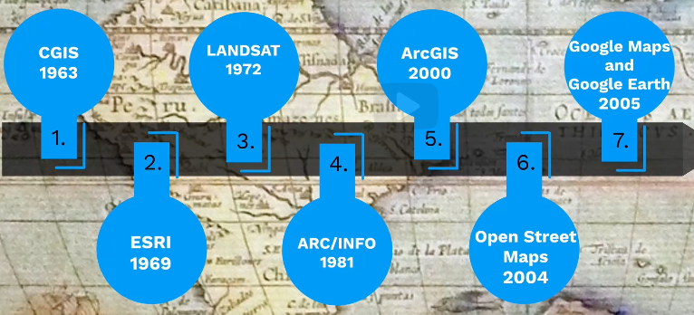
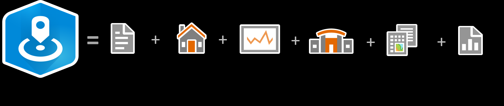

# [Geographic Information Systems - GIS](../../courses.md)

- [Geographic Information Systems - GIS](#geographic-information-systems---gis)
  - [ESRI: GIS Basics](#esri-gis-basics)
  - [ESRI: GIS Foundations](#esri-gis-foundations)
  - [ESRI: Introduction to Coordinate Systems](#esri-introduction-to-coordinate-systems)
    - [Introduction](#introduction)
    - [Geographic Coordinate Systems](#geographic-coordinate-systems)
    - [Projected Coordinate Systems](#projected-coordinate-systems)
  - [ESRI: Introduction to Spatial Data](#esri-introduction-to-spatial-data)
  - [ESRI: Python 101 for ArcGIS](#esri-python-101-for-arcgis)
  - [ESRI: ArcGIS Business Analyst Pro Basics](#esri-arcgis-business-analyst-pro-basics)
  - [ESRI: ArcGIS Business Analyst Pro: Territory Design](#esri-arcgis-business-analyst-pro-territory-design)
  - [ArcGIS Pro Sitemap](#arcgis-pro-sitemap)
    - [Analysis  Tab](#analysis--tab)
      - [Workflows](#workflows)


- [Geographic Information Systems - GIS](#geographic-information-systems---gis)
  - [ESRI: GIS Basics](#esri-gis-basics)
  - [ESRI: GIS Foundations](#esri-gis-foundations)
  - [ESRI: Introduction to Coordinate Systems](#esri-introduction-to-coordinate-systems)
    - [Introduction](#introduction)
    - [Geographic Coordinate Systems](#geographic-coordinate-systems)
    - [Projected Coordinate Systems](#projected-coordinate-systems)
  - [ESRI: Introduction to Spatial Data](#esri-introduction-to-spatial-data)
  - [ESRI: Python 101 for ArcGIS](#esri-python-101-for-arcgis)
  - [ESRI: ArcGIS Business Analyst Pro Basics](#esri-arcgis-business-analyst-pro-basics)
  - [ESRI: ArcGIS Business Analyst Pro: Territory Design](#esri-arcgis-business-analyst-pro-territory-design)
  - [ArcGIS Pro Sitemap](#arcgis-pro-sitemap)
    - [Analysis  Tab](#analysis--tab)
      - [Workflows](#workflows)


## ESRI: GIS Basics

- tools to solve spatial problems;
- GIS components: 
  - hardware (create, share, use)
  - software(store, analyze, display; input, manipulate, query)
  - data (location addr, postal codes, x, y )
  - people
  - workflows (processes and repeatable tasks)

<br/><br/>

- Geopgraphic Information
  - Attributes: non-location information, ID, names, values
  - Location:

<br/><br/>

- Spatial analytics - trends, patterns, relationships
- Field operations - 
- Mapping and visualization - spreadsheets, dbs, live feeds
- Real-time GIS - sensors or devices
- 3D GIS - 
- Imagery and remote sensing - 
- Data collection and management


<br/><br/>

- ArcGIS Online - Cloud based Web GIS deployment 
- ArcGIS Enterprise - within organization's firewall
- ArcGIS Pro - desktop application
- ArcGIS Mobile Apps

<br/><br/>

- Map presentations
  - Static maps
  - Dynamic maps - web maps and web apps


<br/><br/>


## ESRI: GIS Foundations

- What is GIS?
- intro and history
- 
- components: people, data, method (data analysis), hardware, software (tools)
- integrated db: roads, buildings, vegetation
> GIS is about uncovering meaning and insights from within data -- Jack Dangermond 

- data
  - vector 
    - discrete, doesn't continue across entire space
    - representation  
      - points 
      - line 
      - polygons
    - takes less memory
  - raster 
    - aka img -- grid of cells, called pixel 
    - each pixel is a DN - Digital Number -- proportional of light sensed by sensor over that pixel


## ESRI: Introduction to Coordinate Systems

### Introduction

- Coordinate system -- system of imaginary intersecting lines
  - x horizontal distance from origin
  - y vertical distance from origin
  - z height from ground 
- on globe -- when measured in angular degrees
  - latitude
  - longitude
- flat map -- many linear units of measurement
- Round data
  - Prime meridian -- center vertical line (North, South) -- Minor axis -- Longitude -- Meridians
  - Equator -- center horizontal line (West East) -- Major axis -- Latitudes -- Parallels
  - Latitude and Longitude


<br/><br/>

- Earth shape
  - Sphere --- initial thought
  - Ellipsoid -- Mid 18th century
    - bulging at equator -- Oblate ellipsoid
    - Minor and Major axis do not vary much -- so, Spheroid
- Now, there are different mathematical models representing this not so perfect Spheroid.
  - WGS 1984
  - International 1924
  - GRS80 -- more accurate now
  - Clarke 1866 -- most used once upon a time
- Map Tab > Navigate Group > Bookmarks
- When you click on a layer in the Contents pane, a contextual tab appears -- Feature Layer > Compare Group > Swipe tool
- coordinate systems
  - Geographic Coordinate Systems -- GCS -- spherical
    - latitude -- parallels
    - longitude -- meridians
  - Projected --- planar coordinates
    - convert feature locations from spherical earth to a flat map
- differences in spheroids generally become visible at scale 1:5,000,000

### Geographic Coordinate Systems

- 3D Spherical model
- a network of intersecting latitude (parallels) and longitudes (meridians) --- called graticule -- grid
  - imaginary on earth
- now longitude and latitude values are angles measured from earth's center to a point on earth's surface
  - degrees or gradians
  - latitudes
    - run east and west
    - measure distances north and south
  - longitudes
    - run north and south
    - measure distances east and west --- angle
- Components
  - Angular units of measure
  - Prime meridian -- zero value for the longitude (not necessary for all GCS to use same one)
    - Zero value not necessary for latitue because it is always equator
  - Spheroid -- mathematical model
  - Datum -- frame of reference for measuring locations on the surface
    - defines an origin and orientation of latitude and longitude lines
    - defines position of spheroid relative to the center of the earth
    - has a name and date associated with it -- each has an associated spheroid
    - common
      - North American Datum 1927 -- NAD 1927
      - North American Datum 1983
      - World Geodetic Survey 1984  -- WGS 1984
- Catalog > Project > Maps > Map View 
- Catalog > Project > Folders > CSV > rightclick - 
  - Metadata > Catalog View > -- select CSV > Details Panel
  - Export > Table to Point Feature Class > XY Table to Point Tool
    - X - Longitude -- measures x distance
    - Y - Latitude -- measures y distance
- Esri basemaps, use the WGS 1984 Web Mercator (Auxiliary Sphere) coordinate system.
- USS La Moure County Naval Ship Incident -- Crashed because of incompatible CRS
- To create a map to compare global data --- use Earth cerntered datum -- spatial reference

### Projected Coordinate Systems

- cartographers -- one who draws or produces maps
- projection types
  - cylinder | cylindrical
    - wrapping a cylinder around a globe and projecting light through the globe onto the cylinder
    - evenly spaced vertical lines
    - use for map areas extendign north-south
  - cone | conic
    - setting a cone over a globe and projecting light from the center of the globe onto the cone
    - increased distortion towards north and south
    - use for map areas extending east-west
  - plane | azimuthal/planar
    - at poles, longitude lines radiate outwards and latitude lines appear as concentric circles. 
    - most used to map polar regions
    - use for map areas with extent in all directions
- concentric -- share the same center with larger shapes covering smaller ones


<br/><br/>

- Map distortion (shape, area, distance, direction)
- Every projection atleast causes distortion in a minimum of two map properties
- Projections can also be classified by the properties they preserve, or the developable surface on which they are based. 
  - Conformal
    - preserve shape but not area -- regular world map that we studied in school
  - Equal Area
    - preserve area but not shape -- regular map looks like an onion maybe
  - Equidistant -- pizza with a missing slice
    - preserve true scale between one or two points to every other point. 
    - distortion is constant along any given parallel
    - no shape, area, scale distortion along standard parallels
  - Azimuthal
    - preserve direction from one or two points to every other point
    - say azimuthal equidistant
      - any distance measurede from the center of the map will be accurate, but any other point, nope!
  - Gnomonic
    - preserve shortest route (distance and direction) but cannot preserve area
  - Compromise
    - minimizes overall distortion but no one property is preserved
- If a map preserves two spatial properties, one of them is always direction.
- reference
  - to map tropical regions, use a cylindrical projection -- map extends north-south
  - to map middle lattitudes, use conic projections -- map extends east-west
  - to map a polar region, use planar (azimuthal) projection -- equal extent in all directions
- Developable surfaces for creating map projections -- Cone, Plane, Cylinder


## ESRI: Introduction to Spatial Data

- Spatial data -- aka geographic information, geographic data -- map of real world features
- Discrete data -- well-defined boundaries -- say river
- Continuos data -- say elevation, temperature, rainfall --- makes sense to take average


<br/><br/>

- Vector geometry
- vector data model represents discrete objects
  - Point
  - Line -- connects two or more points
  - Polygon -- connects three or more points to form closed loop
  - Vector map -- combination of above?
- vector attributes (col | field | attribute) stored for each feature or row of the data
  - OBJECTID, Shape, Shape_Length, Shape_Area -- autogenerated in polygon attribute table
  - OBJECTID, Shape, Shape_Length -- autogenerated in Polyline attribute table
- Scale of a map can influence the type of vector geometry used -- line vs polygon for rivers


<br/><br/>

- Raster data model
- surface of earth as equal sized cells --- representing portion of the earth -- square meter/mile
- raster <> image but are used interchangeably; raster is a data model; image is a 2D pictorial representation;
- all images are rasters but not the opposite -- say dataset showing rainfall levels is not an image
- band -- represents data collected at a certain wavelength
  - say a satellite capturing image containing eight bands of information -- each at different wavelength of light -- information from different sensors
- Raster attributes -- usually created by sensors
- Multiband raster -- each cell will contain information from each band
- Attribute for each cell is determined by taking the average value of the entire space that the cell covers, so raster with small cells covering smaller amounts of space show greater detail
- Types
  - Continuous raster -- rainfall temperature
  - Discrete data -- soils
  - Imagery -- satellite/aerial/drone imagery -- camera or other sensor
  - Scanned maps -- existing print maps can be scanned and storede as raster


<br/><br/>

- DEM - Digital Elevation Model
- Mosaic dataset can be used to manage raster data


## ESRI: Python 101 for ArcGIS

- variables, data types, functions, conditionals, loops
- libraries
  - ArcPy --- Scripting ArcGIS Pro workflows
    - Geoprocessing
    - Advanced cartography
  - ArcGIS API -- scripting Web GIS workflows
    - ArcGIS Online, ArcGIS Enterprise
    - Manage services, users, groups, content
- workflows ---- repetitiveness and complexity requires automation?
  - Analysis
  - Data management
  - Mapping
  - Administrative tasks


<br/><br/>

```py
import arcpy

file_path = "C:\\Users\\Python 101"
arcpy.env.workspace = file_path
shp_list = arcpy.ListFeatureClasses()
shp_list

target = "C:\\Users\\Python 101\\Python 101 DB.gdb\\Bigfoot_Sightings"
for cryptid in shp_list:
  if "bigfoot" in cryptid.lower():
    arcpy.Append_management(file_path + "\\" + cryptid, target)
    print(cryptid + "appended successfully to target geodatabase")

arcpy.stats.OptimizedHotSpotAnalysis(
  Input_Features = "Bigfoot_Sightings", 
  Output_Features = r"C:\Users\Python 101\Python 101 DB.gdb\Bigfoot_sightings_OptimizedHotSpotAnalysis"
)
```

- Next
  - ArcpyEssentials
  - Creating Python Scripts for ArcGIS
  - Python Tips and Tricks for ArcGIS
  - ArcGIS API for Python Fundamentals
- Resources
  - [Learning Python](https://pro.arcgis.com/en/pro-app/3.4/arcpy/get-started/installing-python-for-arcgis-pro.htm#ESRI_SECTION1_61E320D20F2940209764B72494C9AEAE)
  - [Package Manager](https://pro.arcgis.com/en/pro-app/latest/arcpy/get-started/what-is-conda.htm)
  - [Create lists](https://pro.arcgis.com/en/pro-app/3.4/arcpy/get-started/listing-data.htm)
  - [Setting paths](https://pro.arcgis.com/en/pro-app/latest/arcpy/get-started/setting-paths-to-data.htm)
  - [Automate geoprocessing using history](https://pro.arcgis.com/en/pro-app/latest/help/analysis/geoprocessing/basics/geoprocessing-history.htm#ESRI_SECTION1_DE181D2B95F04F62B3FDEE74391F89BC)
- If you need a third party library within ArcGIS, then you need to clone the default environment


## ESRI: ArcGIS Business Analyst Pro Basics

- Core ArcGIS Pro extension -- business analytics
- Can access demographic data and market analytics
  - population, age, jobs, customer spending, lifestyle, ...
- 
- annual information, 5 year projections, market segmentation, traffic count data, data about products and services, statistics for shopping centers, businesses to analyze competitor locations and sales, market potential data, statistics on crime index
- Trade area Rings -- polygons will be created between consecutive breaks (say 0-1, 1-3, 2-5 minute driving time)
- Trade area Disks -- polygosn will be created from facility to the break (facility to 1/3/5 minute driving time)


## ESRI: ArcGIS Business Analyst Pro: Territory Design

- Territory is one or more geographic areas forming a boundary
- solution -- base layer aka alignment layer + one or more levels of territory layers
- workflow -- Design > Create > Manage > Share -- circular
- Territory solution considerations
  - Geographies -- Census blocks, Response Districts, Zip Codes, ... -- aka Territory alignment layer
  - Centers -- predetermined centers. Territories are point based and use clustering and thiessen polygons with centers
  - Constraints -- rules or restrictions -- Impedence barriers are constraints that prevent a territory from growing beyond a certain line or area, ...
  - Balancing -- ensuring territories have equal statistics -- weight different balancing criteria -- aka variables
  - Levels -- higherarchical layers -- two by default (solution base level and territories level)
- Slelect block groups within five miles of any bicycle customer
  - Map > Selection > Select By Location
    - Input Features -- census blocks layer
    - Relationship -- Within a Distance
    - Selecting Features -- bicycle customers layer
    - Search Distance -- 5, Statute Miles
    - Selection Type -- New Selection
  - You can now right click and export as a new layer
- Design Solution > Create Solution > Solve the solution to create territories > Balance the territories
- Territory Design Contextual Tab
  - Analysis group
    - Add Variables
      - Add Level Variables Tool 
    - Balance Variables
      - Set Balance Variables tool
    - Solve
    - Barriers
      - Add Territory Barriers
  - Visualize group
    - Create Chart
  - Manage Group
    - Add Level
      - Add Territory Level
- The territories do not change. After making changes to variables, constraints, or other parameters, you must solve the territory solution again.


<br/><br/>

- Dynamic Sharing options
  - Infographics
  - Web maps
  - Entire solution
  - Web layers
  - Feature Classes
- Static Sharing Options
  - PDF
  - Reports
  - Tables
  - Paper maps

- Barrier Constraint
  - Restricted-Area barrier constraint requires a polygon layer where territories are not to be created
  - Impedence barrier constraint creates a line barrier that a territory cannot cross

<br/><br/>

- Geoprocessing > Toolboxes
  - Territory Design Tools
    - Analysis 
      - Set Territory Level Options
      - Solve Territories
      - ...
    - Territory Solution
      - Create Territory Solution
      - Copy Territory Solution
      - ...


## ArcGIS Pro Sitemap

### Analysis  Tab

#### Workflows

- Buiness Analysis Menu
  - General Workflows
    - Business and Facilities Search
    - Color COded layer
    - Evaluate Site
    - New Territory Design 
    - Suitability Analysis
    - Add Business Analyst Web App Sites
  - Target Marketing
    - Target Marketing Wizard
    - New Target Group
    - Add Segmentation Profile
    - Add Target Group
  - Huff Model
    - Calibrate Huff Model
    - Run Calibrated Huff Model
    - Run Huff Model
    - Add Huff Model
  - Statistics Data Collections
    - New Statistical Data Collection
    - Add Statistical Data Collection
  - Variable Lsts
    - New Variable Lists
    - Add Variable Lists
    - 
