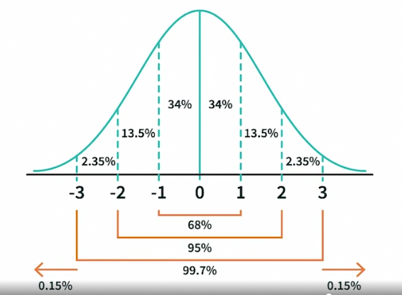
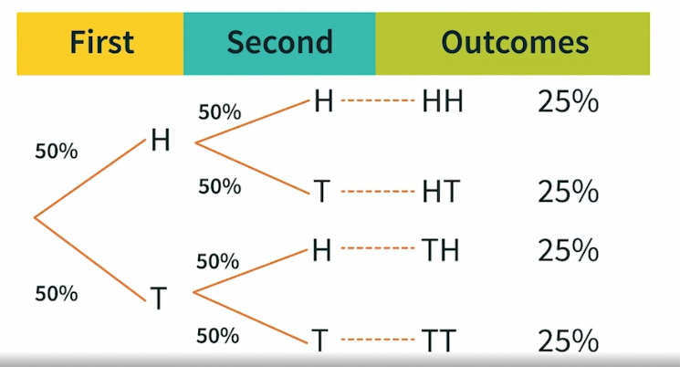
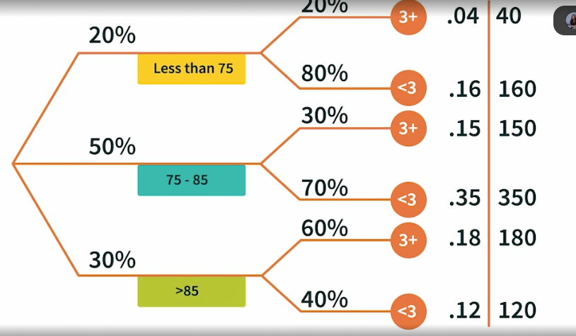
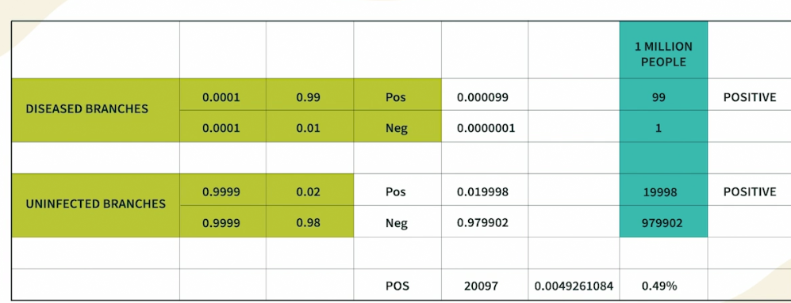
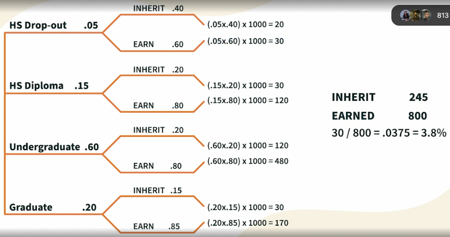
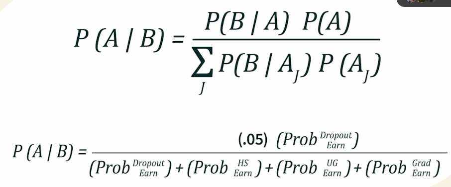

# [Statistics](../../courses.md)

- [Statistics](#statistics)
  - [LinkedIn: Statistcs Foundations 1: The Basics](#linkedin-statistcs-foundations-1-the-basics)
  - [LinkedIn: Statistics Foundations 2: Probability](#linkedin-statistics-foundations-2-probability)
  - [LinkedIn: Statistics Foundations 3: Using Data Sets](#linkedin-statistics-foundations-3-using-data-sets)
  - [LinkedIn: Statistics Foundations 4: Advanced Topics](#linkedin-statistics-foundations-4-advanced-topics)
  - [LinkedIn: Excel Statistics Essential Training: 1](#linkedin-excel-statistics-essential-training-1)
  - [LinkedIn: Excel Statistics Essential Training: 2](#linkedin-excel-statistics-essential-training-2)
  - [LinkedIn: Statistical Analysis with Wolfram Language](#linkedin-statistical-analysis-with-wolfram-language)

## LinkedIn: Statistcs Foundations 1: The Basics

- data can tell stories (charts, graphs, and tables)

- ...
  - tables
  - frequency table
  - dot plot / scatter plot
  - histograms - bar chart for each interval -- binn, freq
  - relative frequency histogram -- bin, freq, freq %, cumulative %
  - pie chart
- data - mystery - can contain story - how do we unravel?
- dataset - collection of data points

  

- start by knowing center of data
  - mean: average
    - $\sum x_i / N $ `SUM()` `AVERAGE()`
  - median: middle (needs data to be sorted)
    - $(N+1)/2$ `MEDIAN()`
      - if this turns out to be fractional - consider $(int(res) + ceil(res)) / 2$
  - mode: most common 
    - `MODE()`
    - no mode
    - unimodal
    - bimodal
    - many modes
  - takeaway
    - median tells half the data points are less than it and half are greter than it
    - if median > mean -- some might have small values that pulled down the average
    - if median < mean -- some might have large values that pushed the average

  

- next by knowing how different data is. how close/how far away are data points from each other : Variability
  - range
    - largest - smallest
    - only takes two data points into consideration
  - standard deviation
    - z-score: A point's distance, in standard deviations, from the mean
      - $z-score =  \dfrac{x_i(data \space point) - \bar{x}(mean)}{S (standard \space deviation)}$
    - Standard deviation is denoted by $\sigma$ - Average squared distance from the mean
    - $\sigma = \sqrt{\dfrac{\sum(x_i - \bar{x})^2} {N-1}}$
    - $N$ is Sample Size

  

- Empirical rule
- Empirical rule says most of data points in a given data set fall within three standard deviations of the mean
- Aids in nderstanding distribution of data points in our data sets
- works for symmetrically or normally distributed data, well centered -- bell shaped pattern, mirrored along y axis
- $68\% - 95\% - 99.7\%$ -- only $0.3\%$ falls outside of that region
- 

  

- Outliers
- A data point that is an abnormal distance from the other values in the data set; strange outcome
- not likely to happen again - can ignore with caution - not worthy of investigation? / opportunity to learn?
  - beginning of a new trend?
- questions
  - really an outlier?
  - how did this happen?
  - what can we learn?
  - what needs to change?
- lone outlier can sometimes provide a brand new perspective

## LinkedIn: Statistics Foundations 2: Probability

- **probability**
  - associated with uncertainities
  - percent chance of something happening
  - a ratio - `probability = desirede outcome / possible outcomes`
- **empirical probability** -- based on experimental or historical data
- **even odds** ~ equal chances
- **weighted odds** - real wordld -- multiple variables associated
- **sample space** - sum of all probabilities will eaual 100%.
- **permutations** 
  - arrangement, order is of interest
  - $n!$
  - $\dfrac {n!}{(n-x)!}$ where n = number of objects, x = number of objects to be selected
- **combinations**
  - order doesn't matter
  - $\dfrac {n!}{(n-x)! * x!}$ where n = number of objects, x = number of objects to be chosen at one time
- **percentile**
  - among all, you are in top x%
  - rounded down
  - $\% rank = \dfrac {NumberOfValuesBelowX + 0.5}{TotalNumberOfValues} * 100$

  

- multiple event probabilities
- you can add probabilities of individual events as long as you are subtracting the overlapping probabilities
  - say, probability of 7 and 11 when rolling two dies
- probability trees
  - how probabilities change with each action/outcome  
  - 
  - probability of HH initially 25%; But say first coint is Heads, now the probability of HH increased to 50%
  - 
  - 
- multiplication rule
  - caution: dependent and independent events
  - independent event probabilities can be multiplied directly
- **false negative** type 2 error
- **false positive** type 1 error
- **Bayes theorem**
  - $P(\frac {A}{B}) = \dfrac {P(\frac {B}{A}) * P(A)}{\sum_J P(\frac {B}{A_J})P(A_J)}$
  - 
  - 

  

- random variable
  - discrete -- while, categories, limited possibilities
  - continuous -- decimal, real, endless possibilities
- discreate -- whole numbers; experimental results
- binomial -- experiment with only two possible outcomes
  - when p (chance of success) = 0.50 and n gets very big, distribution becomes normal distribution
- probability densities
  - curves used to illustrate distribution of outcomes
  - Area Under the Curve - probability of each and every outcome
    - formula of the curve, and calculus for integral
- bell-shaped curve
  - left-skewed -- tail is to the left
  - right-skewed -- tail is to the right
  - normal curve
    - mean is centered at the highest point of the curve
    - data is symmetrical over mean
    - curve never touches axis
    - AUC = 1
- z-transformation
  - 

## LinkedIn: Statistics Foundations 3: Using Data Sets

## LinkedIn: Statistics Foundations 4: Advanced Topics

## LinkedIn: Excel Statistics Essential Training: 1

## LinkedIn: Excel Statistics Essential Training: 2

## LinkedIn: Statistical Analysis with Wolfram Language

