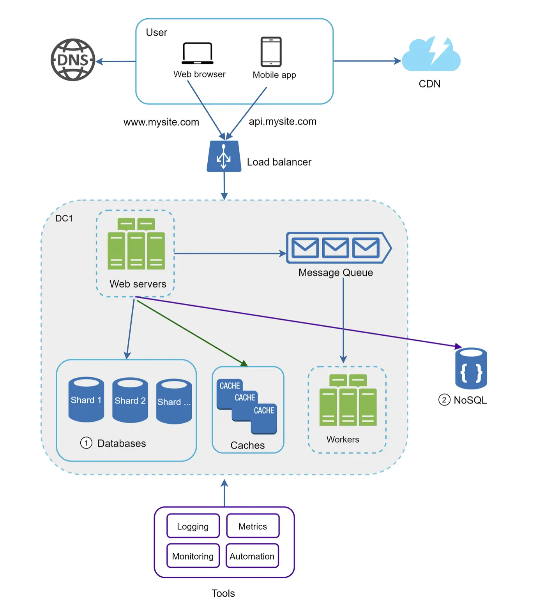
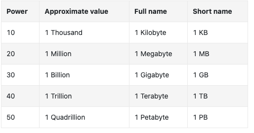
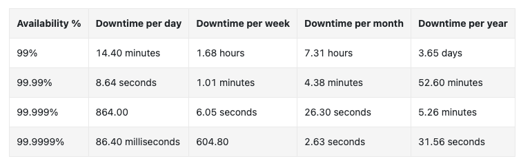

# [System Design](../../course.md)

## BYteByteGo: System Design

### Scale from Zero to Millions of Users

- everything runnign on one server (app, db, cache, ...)
  - 
  - 
- DNS - Domain Name System
- IP - Internet Protocol address
- HTTP - HyperText Transfer Protocol
- HTML - HyperText Markup Language
- JSON - JavaScript Object Notation

  

- One server for Web/Mobile traffic -- web tier, One server for Database -- data tier
  - 
- Scale independently
- RDBMS - Relational Database Management System | SQL -- MySQL, Oracle database, PostgreSQL 
  - tables and rows; support joins
- Non-Relational | NoSQL -- super low latency; unstructured; only need serialize and deserialize (JSON, XML, YAML), massive data
  - CouchDB
  - Neo4j
  - Cassandra
  - HBase
  - Amazon DynamoDB
- NoSQL types
  - Key-value stores
  - Graph stores
  - Column stores
  - Document stores

  

- Vertical Scaling -- Scale Up -- add more power
  - hard limit; no unlimited 
  - no failover or redundancy
- Horizontal Scaling -- scale-out -- add more servers

  

- Load Balancer
  - 
- evenly distributes incoming traffic 
- users connect to public ip of LB
- LB communicates with servers using private IPs (not accessible to public or outside the network)
- solves failover, and availability

  

- DB replication 
  - 
- master db -- generally only supports write operations -- insert, delete, update
- slave db -- copy of master, supports only read operations
- usually higher read to write ratios --> more slaves 
- solves
  - better performance -- parallel processing of queries
  - reliability -- no worry of data loss
  - high availability 
- slave fail: redirect temporarily to master / other healthy salve, and create a new slave db inplace of old
- master fail: promote slave to master, create new slave
  - data in slave might not be up to date   
    - update missing data by running data recovery scrits
- multi-masters and circular replication 

  

- Cache: temp storage area -- store expensive responses / frequently accessed data
- cache tier -- improves system performance and reduces db workloads 
- read-through cache
  - query cache, if not present, query db, store in cache, return 
- `cache.set('myKey, 'hi there', 3600 * SECONDS)`
- considerations
  - read frequently but modify infrequently
  - expiration policy -- too short (frequent reloads), too long (data might be stale)
  - consistency -- cache and data store in sync ( if not in single transaction, inconsistent)
  - single cache server -- SPOF Single Point of Failure
  - eviction policy 
    - LRU - Least Recently Used
    - LFU - Least Frequently Used
    - FIFO - First In First Out

  

- CDN 
  - 
  - 
- Content Delivery Network -- geographically dispersed servers -- deliver static content
- There's also dynamic content caching
- `https://mysite.cloudfront.net/logo.jpg` `https://mysite.akamai.com/image-manager/img/logo.jpg`
- user -> cdn -> origin -> cdn -> user 
  - origin can optionally send header containing TTL Time To Live
- considerations
  - third-party providers: charged for data transfers in and out of CDN
  - cache expiry
  - cdn fallback 
    - if there is a temp outage, client should be able to req resources from origin 
  - invalidating files
    - invalide cdn objects before expiry
  - object versioning `?v=2` using parameters or query strings
- 

  

- Stateless web tier
- stateful server -- remembers client data between requests 
  - 
  - every req from same client must be routed to same server
    - can be done using sticky sessions in load balancers
- stateless server -- keeps no information
  - 
  - state is stored in shared db NoSQL or SQL -- persistent data store

  

- Data centers
- users are geoDNS routed -- based on their location to the closest Data center
- geoDNS -- allows Domain Names to resolve to IP addresses based on user location
- 
- challenges
  - traffic redirection
  - data synchronization -- in failover cases traffic might be routed to a datacenter where data is not available.
    - asynchronous multi-data center replication
  - test and deployment

  

- message queue
- we need to decouple components to scale further
- MQ is a durable component, stored in memory, supports asynchronous communication
- serves as a buffer and distributes asynchronous requests
- input services -- producers / publishers
- consumers / subscribers
- can post or consume even when consumer or producer is not available
- 

  

- logging
  - per server level or aggreate to a centralized service
- metrics
  - cpu memory disk io, ...
  - aggregated: performance of database tier, cache tier, ...
  - key business metrics: daily active users, retention, revenue, ...
- automation
  - continuous integration -- each code check-in is verified through automation
  - build, test, deploy, ..
- 

  

- scaling database
- vertical scaling -- scale up
  - Amazon Relational Database Service (RDS) -- upto 24TB RAM, 
  - overall cost is high
  - greater risk of SPOF
- horizontal scaling -- sharding
  - add more servers
  - separates large databases into smaller shards
  - each shard has the same schema but data is unique to shard
  - user data is allocated to a database based on user ids, 
    - hash user id, and put corresponding data in the resulting hash value's shard
  - sharding key -- partition key -- one or more cols that determine how data is distributed
    - must evenly distribute data
  - sharding key allows you to route db queries to the correct db
- challenges
  - resharding data
    - a single shard could no longer hold more data
    - faster shard exhaustion because of bad hashing function
    - consistent hashing: common solution
  - celebrity problem 
    - aka hotspot key problem
    - each shard for a single celebrity
  - join and de-normalize
    - de-normalize queries can be performed in a single table
- 

  

- optimize system and decouple to even smaller services

#### [Should You Go Beyond Relational Databases](https://blog.teamtreehouse.com/should-you-go-beyond-relational-databases)

- symptoms
  - lots of cols but only few are used by row
  - ugly joins
  - serializing it to JSON, YAML, XML, ... and dumping it to db
  - many many to many join tables, and tree like structures
  - frequent schema changes to represent incoming data
- scalability issues
  - reaching write capacity limit for single db server
  - slower page loads due to background batch processes overwhelming db
  - data greater than the server can hold

  

- [Google BigTable](https://research.google.com/archive/bigtable-osdi06.pdf)
- cols don't need to be pre-defined
- rows can be of any no of cols
- empty cols are not stored at all
- inspired 
  - HBase
  - Hypertable
  - Cassandra
- a row in bigtable corresponds to a document in document db
- open source document db
  - Project Voldemort
  - CouchDB
  - MongoDB
  - ThruDB
  - Jackrabbit
- document dbs can work with structure of documents. Extracting, indexing, aggregating and filtering based on attribute values within documents
- limitation
  - most cannot perform joins or transactions spanning several rows or documents
    - allows db to do automatic partitioning

  

- Graph Databases
- focus on relationships between items
- standard sql cannot query transitive relationships
- symptoms
  - long chains of joins
  - loops of queries to follow a unknown length of chain of relationships
  - lots of many to many and tree like data structures
- choices
  - Neo4j
  - AllegroGraph
  - Sesame (uses MySQL or PostgresQL as storage back-end)
  - FreeBase and DirectedEdge have their own internal graph dbs

  

- MapReduce
- a way of writing batch processing jobs without having to worry about infrastructure
- options / implementations of MapReduce model
  - Hadoop 
  - Skynet
  - Disco
  - CouchDB -- includes models on a smaller scale

  

- Distributed key-value stores
- really about scalability. 
- can transparently partition and replicate your data across many machines in a cluster
- you don't need to come up with a sharding scheme to decide on which server holds data. 
- DB does it for you
- decide on low latency vs high throughput (batch procession jobs)
- options
  - certain data consistency
    - BigTable 
    - Scalaris
    - Dynomite
    - Ringo 
  - focus on low latency
    - MemcacheDB
    - Tokyo Cabinet (with Tokyo Tyrant for network service and LightCloud to make it distributed)
- eventual consistency [Amazon's Dynamo](http://www.allthingsdistributed.com/2007/10/amazons_dynamo.html)
- Brewer's CAP theorem -- consistency, availability, partition tolerance, you can only choose two at a time

  

- vendor / hosting provider
  - Google's datastore
  - Amazon simpledB
  - windows azure storage services
  - force.com
- judgement
  - whos' using software in production and for what service
  - lively open-source community?
  - some benchmarks of your own

  

### Back of the envelope estimation 

- system capacity or performance requirements
  - using common performance numbers and thoght experiment
- power of 2
  - 
- latency
  - 
  - 
- memory > disk ; avoid disk; simple compression algorithms are fast; compress before sending over internet
- SLA - Service Level Agreement - uptime
- 
- DAU - Daily Active Users
- QPS - Queries Per Second
- tips 
  - rounding and approximation
  - write down your assumptions
  - label your units

  

### A framework for system design interviews

- purpose 
  - two co-workers collaborating on an ambiguous problem and come up with a sol meeting goals
  - design process, design skill, defending design choices, respond to feedback in constructive manner
  - ability to collaborate
  - work under pressure
  - resolve ambiguity constructively
  - ability to ask good questions
  - red flags
    - over-engineering
    - ignoring tradeoffs
    - narrow mindedness
    - stubbornness

  

#### Step 1 : Understand the problem and establish design scope

- don't give out an answer quickly without thinking
- there is no right answer
- think deep, ask questions to clarify requirements and assumptions
- gather all required information
- write down your assumptions

  

- questions
  - what specific features
  - number of users
  - rate of scaling
  - tech stack
  - mobile/web/both
  - traffic vol

#### Step 2: Propose high level design and get buy-in

- come up with initial blueprint. 
- ask for feedback.
- draw box diagrams of components
- do back-of-the-envelope calculations -- checks if it scales; confirm with interviewer
- think out loud
- go through concrete use cases -- discover edge cases
-  

#### Step 3: Deep Design Dive

- agreed on overall goals and feature scope
- sketched out high level blueprint
- obtained feedback 
- initial ideas about areas to focus on in deep dive based on feedback

  

- identify and prioritize components in architecture
- system performance characteristics -- bottlenecks and resource estimations
- url shortener -- hash function 
- chat system -- latency and support online/offline status
- time management -- focus on what demonstrates your abilities
- don't get into unnecessary details

#### Step 4: Wrap up

- follow up questions
- identify system bottlenecks and discuss potential improvements
- showcase critical thinking and leave a good final impression
- recap of the design; imp if you suggested few solutions
- refresh memory
- error cases are interesting
- operation issues are worth mentioning
  - monitoring and logging
  - roll out
- handling next scale curve

  

- let interviewer know what you are thinking
- suggest multiple approaches
- bounce ideas off the interviewer
- prepare for typical interview questions
- clarrify requirements and assumptions before jumpign into solution
- high level design first, then drill down
- ask for hints when stuck
- ask for feedback early and often

  

- 3-10; 10-15; 10-25; 3-5 --- usually 45-60 m interview

  

### Design A Rate Limiter

- rate limitter: controls rate of traffic sent by client or a service
- limits number of client requests (say api requests)
  - say mc d deals (once per day | 15m)
- benefits
  - prevent resource starvation --- Denial of Service (DoS) attack
    - say 300 per user per 60 seconds
  - reduce cost
    - say checking credit, make payment, retrieve health, ...
  - prevent servers from being overloaded

  

#### Step 1 - Understand problem and establish design scope

- what kind of rate-limiter -- client side rate limiter or server-side API rate limiter
  - server-side
- does rate limitter throttle api requests based on ip, userid, ... 
  - need to be flexible enough to support different setss of throttle rules
- scale of the system, startup? bigcompany? no of users?
  - handle large number of requests
- will it work in a distributed env
  - yes
- is RL a separate service or part of application code
  - upto you
- should we inform throttled users?
  - yes

  

- requirements
  - accurately limit excessive reqs
  - low latency: should not slow down http resp time
  - as little memory as possible
  - distributed rate limiting
  - exception handling -- when requests are throttled
  - high fault tolerance

#### Step 2: Propose high-level design and get buy-in

- where to put rate limitter
  - client-side: unreliable, can be forged, no control over implementation
  - server-side: 
    - you can put it at server
    - or you can put it as a middleware
      - 
- HTTP 429: too many requests
- cloud microservices have become popular
- RL is usually implemented in component called API Gateway (middleware) -- fully managed service supporting 
  - rate limiting 
  - ssl termination
  - authentication
  - ip whitelisting
  - servicing static content .. 
- so should we implement it on server-side or in gateway?
  - eval current tech stack
    - make sure curr programming lang is efficient to implement RL Server Side
  - identify rate limiting algorithm that fits the needs
  - if you already used microservice architecture and included an api gateway in design to perform authentication ..., implment RL here

#### RL Algo

- token bucket
- leaking bucket
- fixed window counter
- sliding window log
- sliding window counter

  

- token bucket algo
- simple, commonly used by internet companies
  - amazon and stripe use this
- algo
  - TKB is a container with pre-defined capacity
  - 

  

### Design Consistent Hashing

  

### Design A Key value store

  

### Design A Unique ID Generator in Distributed Systems

  

### Design A URL Shortener

  

### Design A Web Crawler

  

### Design A Notification System

  

### Design A Newsfeed System

  

### Design A Chat System

  

### Design A Search Autocomplete System

  

### Design Youtube

  

### Design Google Drive

  

### Proximity Service

  

### Nearby Friends

  

### Google Maps

  

### Distributed Message Queue

  

### Metrics Monitoring and Alerting System 

  

### Ad Click Event Aggregation 

  

### Hotel Reservation System

  

### Distributed Email Service

  

### S3-like Object Storage

  

### Real-time Gaming Leaderboard

  

### Payment System

  

### Digital Wallet

  

### Stock Exchange

  

### Conclusion